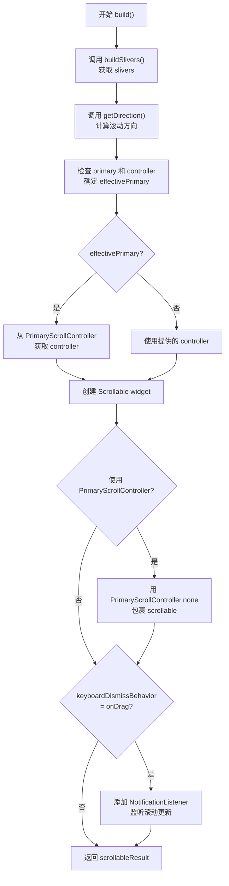
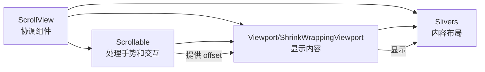
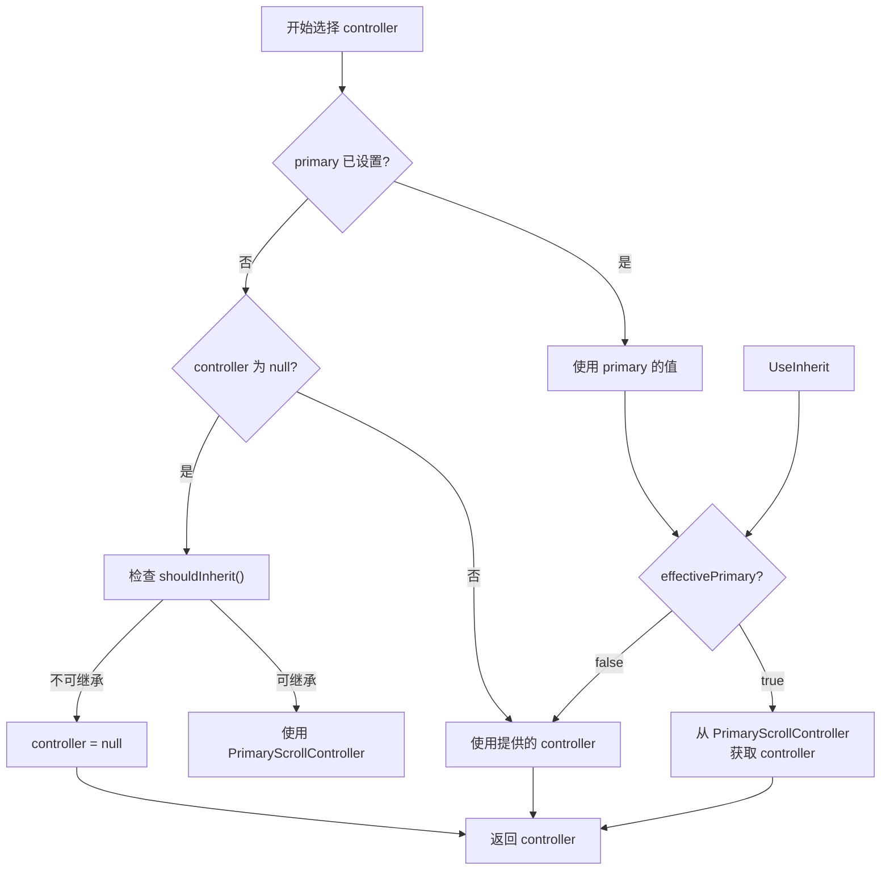

# ScrollView 代码讲解

## 概述

`ScrollView` 是 Flutter 中滚动视图的抽象基类，它组合了 `Scrollable` 和 `Viewport` 来创建一个可交互的一维滚动内容面板。

### 三个核心组件

`ScrollView` 由三个核心组件构成：

1. **Scrollable**：监听各种用户手势，实现滚动的交互设计
2. **Viewport**：实现滚动的视觉设计，只显示滚动视图内部的一部分 widget（如 `Viewport` 或 `ShrinkWrappingViewport`）
3. **Slivers**：可以组合创建各种滚动效果的 widget，如列表、网格和可展开的头部

`ScrollView` 通过创建 `Scrollable` 和 viewport 来协调这些组件，并将 slivers 的创建委托给子类。

### 在 Flutter 滚动体系中的位置

`ScrollView` 是 Flutter 滚动体系的核心抽象类，位于以下层次结构中：

- `StatelessWidget`（基类）
  - `ScrollView`（抽象类）
    - `CustomScrollView`（自定义滚动视图）
    - `BoxScrollView`（单子布局模型）
      - `ListView`（列表视图）
      - `GridView`（网格视图）

## 类定义和继承关系

```dart 95:95:lib/src/widgets/scroll_view.dart
abstract class ScrollView extends StatelessWidget {
```

`ScrollView` 是一个抽象类，继承自 `StatelessWidget`。这意味着：

- 它是无状态的，所有配置通过构造函数参数传入
- 子类必须实现 `buildSlivers()` 方法来提供具体的 slivers
- 它使用模板方法模式，定义了构建流程的骨架，具体实现由子类完成

### 子类关系

- **CustomScrollView**：直接使用 slivers 列表创建自定义滚动效果
- **BoxScrollView**：使用单一子布局模型（如 ListView、GridView）
- **ListView**：最常见的滚动视图，显示线性列表
- **GridView**：显示二维网格布局

## 构造函数详解

```dart 107:142:lib/src/widgets/scroll_view.dart
  const ScrollView({
    super.key,
    this.scrollDirection = Axis.vertical,
    this.reverse = false,
    this.controller,
    this.primary,
    ScrollPhysics? physics,
    this.scrollBehavior,
    this.shrinkWrap = false,
    this.center,
    this.anchor = 0.0,
    this.cacheExtent,
    this.semanticChildCount,
    this.paintOrder = SliverPaintOrder.firstIsTop,
    this.dragStartBehavior = DragStartBehavior.start,
    this.keyboardDismissBehavior,
    this.restorationId,
    this.clipBehavior = Clip.hardEdge,
    this.hitTestBehavior = HitTestBehavior.opaque,
  }) : assert(
         !(controller != null && (primary ?? false)),
         'Primary ScrollViews obtain their ScrollController via inheritance '
         'from a PrimaryScrollController widget. You cannot both set primary to '
         'true and pass an explicit controller.',
       ),
       assert(!shrinkWrap || center == null),
       assert(anchor >= 0.0 && anchor <= 1.0),
       assert(semanticChildCount == null || semanticChildCount >= 0),
       physics =
           physics ??
           ((primary ?? false) ||
                   (primary == null &&
                       controller == null &&
                       identical(scrollDirection, Axis.vertical))
               ? const AlwaysScrollableScrollPhysics()
               : null);
```

### 参数验证（断言检查）

构造函数包含四个重要的断言检查：

1. **controller 与 primary 互斥**（126-131 行）：
   - 不能同时提供 `controller` 和设置 `primary` 为 `true`
   - 原因：Primary ScrollView 通过继承从 `PrimaryScrollController` widget 获取 ScrollController

2. **shrinkWrap 与 center 互斥**（132 行）：
   - 如果 `shrinkWrap` 为 `true`，`center` 必须为 `null`
   - 原因：ShrinkWrappingViewport 不支持 center 参数

3. **anchor 范围检查**（133 行）：
   - `anchor` 必须在 0.0 到 1.0 之间（包含）

4. **semanticChildCount 非负**（134 行）：
   - 如果提供，必须大于等于 0

### physics 的默认值逻辑

`physics` 参数的默认值逻辑（135-142 行）非常巧妙：

```dart
physics = physics ??
    ((primary ?? false) ||
            (primary == null &&
                controller == null &&
                identical(scrollDirection, Axis.vertical))
        ? const AlwaysScrollableScrollPhysics()
        : null);
```

逻辑说明：

- 如果显式提供了 `physics`，使用提供的值
- 否则，如果满足以下任一条件，使用 `AlwaysScrollableScrollPhysics()`：
  - `primary` 明确为 `true`
  - `primary` 为 `null` 且 `controller` 为 `null` 且 `scrollDirection` 为 `Axis.vertical`
- 其他情况使用 `null`（使用平台默认的物理效果）

这意味着：默认情况下，垂直滚动且没有提供 controller 的 ScrollView 会自动使用 `AlwaysScrollableScrollPhysics()`，使其始终可滚动。

## 核心属性讲解

### 滚动方向相关

#### scrollDirection

```dart 144:152:lib/src/widgets/scroll_view.dart
  /// {@template flutter.widgets.scroll_view.scrollDirection}
  /// The [Axis] along which the scroll view's offset increases.
  ///
  /// For the direction in which active scrolling may be occurring, see
  /// [ScrollDirection].
  ///
  /// Defaults to [Axis.vertical].
  /// {@endtemplate}
  final Axis scrollDirection;
```

- **作用**：指定滚动视图的偏移量沿哪个轴增加
- **默认值**：`Axis.vertical`（垂直滚动）
- **可选值**：`Axis.vertical` 或 `Axis.horizontal`

#### reverse

```dart 154:168:lib/src/widgets/scroll_view.dart
  /// {@template flutter.widgets.scroll_view.reverse}
  /// Whether the scroll view scrolls in the reading direction.
  ///
  /// For example, if the reading direction is left-to-right and
  /// [scrollDirection] is [Axis.horizontal], then the scroll view scrolls from
  /// left to right when [reverse] is false and from right to left when
  /// [reverse] is true.
  ///
  /// Similarly, if [scrollDirection] is [Axis.vertical], then the scroll view
  /// scrolls from top to bottom when [reverse] is false and from bottom to top
  /// when [reverse] is true.
  ///
  /// Defaults to false.
  /// {@endtemplate}
  final bool reverse;
```

- **作用**：控制滚动视图是否按阅读方向滚动
- **默认值**：`false`
- **示例**：
  - 垂直滚动：`reverse = false` 时从上到下，`reverse = true` 时从下到上
  - 水平滚动：`reverse = false` 时从左到右，`reverse = true` 时从右到左

#### getDirection()

```dart 405:419:lib/src/widgets/scroll_view.dart
  /// Returns the [AxisDirection] in which the scroll view scrolls.
  ///
  /// Combines the [scrollDirection] with the [reverse] boolean to obtain the
  /// concrete [AxisDirection].
  ///
  /// If the [scrollDirection] is [Axis.horizontal], the ambient
  /// [Directionality] is also considered when selecting the concrete
  /// [AxisDirection]. For example, if the ambient [Directionality] is
  /// [TextDirection.rtl], then the non-reversed [AxisDirection] is
  /// [AxisDirection.left] and the reversed [AxisDirection] is
  /// [AxisDirection.right].
  @protected
  AxisDirection getDirection(BuildContext context) {
    return getAxisDirectionFromAxisReverseAndDirectionality(context, scrollDirection, reverse);
  }
```

- **作用**：计算具体的滚动方向（`AxisDirection`）
- **考虑因素**：
  - `scrollDirection`（垂直或水平）
  - `reverse`（是否反向）
  - 环境 `Directionality`（对于水平滚动，考虑 RTL/LTR）

### 控制器相关

#### controller

```dart 170:184:lib/src/widgets/scroll_view.dart
  /// {@template flutter.widgets.scroll_view.controller}
  /// An object that can be used to control the position to which this scroll
  /// view is scrolled.
  ///
  /// Must be null if [primary] is true.
  ///
  /// A [ScrollController] serves several purposes. It can be used to control
  /// the initial scroll position (see [ScrollController.initialScrollOffset]).
  /// It can be used to control whether the scroll view should automatically
  /// save and restore its scroll position in the [PageStorage] (see
  /// [ScrollController.keepScrollOffset]). It can be used to read the current
  /// scroll position (see [ScrollController.offset]), or change it (see
  /// [ScrollController.animateTo]).
  /// {@endtemplate}
  final ScrollController? controller;
```

- **作用**：控制滚动视图的滚动位置
- **用途**：
  - 控制初始滚动位置（`initialScrollOffset`）
  - 控制是否自动保存和恢复滚动位置（`keepScrollOffset`）
  - 读取当前滚动位置（`offset`）
  - 改变滚动位置（`animateTo`、`jumpTo`）

#### primary

```dart 186:224:lib/src/widgets/scroll_view.dart
  /// {@template flutter.widgets.scroll_view.primary}
  /// Whether this is the primary scroll view associated with the parent
  /// [PrimaryScrollController].
  ///
  /// When this is true, the scroll view is scrollable even if it does not have
  /// sufficient content to actually scroll. Otherwise, by default the user can
  /// only scroll the view if it has sufficient content. See [physics].
  ///
  /// Also when true, the scroll view is used for default [ScrollAction]s. If a
  /// ScrollAction is not handled by an otherwise focused part of the application,
  /// the ScrollAction will be evaluated using this scroll view, for example,
  /// when executing [Shortcuts] key events like page up and down.
  ///
  /// On iOS, this also identifies the scroll view that will scroll to top in
  /// response to a tap in the status bar.
  ///
  /// Cannot be true while a [ScrollController] is provided to `controller`,
  /// only one ScrollController can be associated with a ScrollView.
  ///
  /// Setting to false will explicitly prevent inheriting any
  /// [PrimaryScrollController].
  ///
  /// Defaults to null. When null, and a controller is not provided,
  /// [PrimaryScrollController.shouldInherit] is used to decide automatic
  /// inheritance.
  ///
  /// By default, the [PrimaryScrollController] that is injected by each
  /// [ModalRoute] is configured to automatically be inherited on
  /// [TargetPlatformVariant.mobile] for ScrollViews in the [Axis.vertical]
  /// scroll direction. Adding another to your app will override the
  /// PrimaryScrollController above it.
  ///
  /// The following video contains more information about scroll controllers,
  /// the PrimaryScrollController widget, and their impact on your apps:
  ///
  /// {@youtube 560 315 https://www.youtube.com/watch?v=33_0ABjFJUU}
  ///
  /// {@endtemplate}
  final bool? primary;
```

- **作用**：标识这是否是与父 `PrimaryScrollController` 关联的主滚动视图
- **当 `primary = true` 时**：
  - 即使内容不足以滚动，视图也始终可滚动
  - 用于默认的 `ScrollAction`（如键盘快捷键）
  - 在 iOS 上，点击状态栏会滚动到顶部
- **默认值**：`null`（自动判断是否继承）
- **自动继承规则**：
  - 在移动平台上，垂直方向的 ScrollView 会自动继承 `PrimaryScrollController`
  - 可以通过 `PrimaryScrollController.shouldInherit()` 判断

### 物理效果相关

#### physics

```dart 226:266:lib/src/widgets/scroll_view.dart
  /// {@template flutter.widgets.scroll_view.physics}
  /// How the scroll view should respond to user input.
  ///
  /// For example, determines how the scroll view continues to animate after the
  /// user stops dragging the scroll view.
  ///
  /// Defaults to matching platform conventions. Furthermore, if [primary] is
  /// false, then the user cannot scroll if there is insufficient content to
  /// scroll, while if [primary] is true, they can always attempt to scroll.
  ///
  /// To force the scroll view to always be scrollable even if there is
  /// insufficient content, as if [primary] was true but without necessarily
  /// setting it to true, provide an [AlwaysScrollableScrollPhysics] physics
  /// object, as in:
  ///
  /// ```dart
  ///   physics: const AlwaysScrollableScrollPhysics(),
  /// ```
  ///
  /// To force the scroll view to use the default platform conventions and not
  /// be scrollable if there is insufficient content, regardless of the value of
  /// [primary], provide an explicit [ScrollPhysics] object, as in:
  ///
  /// ```dart
  ///   physics: const ScrollPhysics(),
  /// ```
  ///
  /// The physics can be changed dynamically (by providing a new object in a
  /// subsequent build), but new physics will only take effect if the _class_ of
  /// the provided object changes. Merely constructing a new instance with a
  /// different configuration is insufficient to cause the physics to be
  /// reapplied. (This is because the final object used is generated
  /// dynamically, which can be relatively expensive, and it would be
  /// inefficient to speculatively create this object each frame to see if the
  /// physics should be updated.)
  /// {@endtemplate}
  ///
  /// If an explicit [ScrollBehavior] is provided to [scrollBehavior], the
  /// [ScrollPhysics] provided by that behavior will take precedence after
  /// [physics].
  final ScrollPhysics? physics;
```

- **作用**：控制滚动视图如何响应用户输入
- **默认行为**：匹配平台约定
- **重要提示**：
  - 物理效果只有在**类**改变时才会重新应用
  - 仅创建新实例不会触发更新（性能优化）
- **优先级**：`scrollBehavior` 提供的 `ScrollPhysics` 会覆盖 `physics`

#### scrollBehavior

```dart 268:269:lib/src/widgets/scroll_view.dart
  /// {@macro flutter.widgets.scrollable.scrollBehavior}
  final ScrollBehavior? scrollBehavior;
```

- **作用**：提供滚动行为配置，包括物理效果、滚动条样式等
- **优先级**：高于 `physics` 参数

### 布局相关

#### shrinkWrap

```dart 271:289:lib/src/widgets/scroll_view.dart
  /// {@template flutter.widgets.scroll_view.shrinkWrap}
  /// Whether the extent of the scroll view in the [scrollDirection] should be
  /// determined by the contents being viewed.
  ///
  /// If the scroll view does not shrink wrap, then the scroll view will expand
  /// to the maximum allowed size in the [scrollDirection]. If the scroll view
  /// has unbounded constraints in the [scrollDirection], then [shrinkWrap] must
  /// be true.
  ///
  /// Shrink wrapping the content of the scroll view is significantly more
  /// expensive than expanding to the maximum allowed size because the content
  /// can expand and contract during scrolling, which means the size of the
  /// scroll view needs to be recomputed whenever the scroll position changes.
  ///
  /// Defaults to false.
  ///
  /// {@youtube 560 315 https://www.youtube.com/watch?v=LUqDNnv_dh0}
  /// {@endtemplate}
  final bool shrinkWrap;
```

- **作用**：控制滚动视图在滚动方向上的尺寸是否由内容决定
- **默认值**：`false`（扩展到最大允许尺寸）
- **性能影响**：`shrinkWrap = true` 时性能开销更大，因为需要在每次滚动位置改变时重新计算尺寸
- **使用场景**：当滚动视图在滚动方向上有无界约束时，必须设置为 `true`

#### center

```dart 291:325:lib/src/widgets/scroll_view.dart
  /// The first child in the [GrowthDirection.forward] growth direction.
  ///
  /// Children after [center] will be placed in the [AxisDirection] determined
  /// by [scrollDirection] and [reverse] relative to the [center]. Children
  /// before [center] will be placed in the opposite of the axis direction
  /// relative to the [center]. This makes the [center] the inflection point of
  /// the growth direction.
  ///
  /// The [center] must be the key of one of the slivers built by [buildSlivers].
  ///
  /// Of the built-in subclasses of [ScrollView], only [CustomScrollView]
  /// supports [center]; for that class, the given key must be the key of one of
  /// the slivers in the [CustomScrollView.slivers] list.
  ///
  /// Most scroll views by default are ordered [GrowthDirection.forward].
  /// Changing the default values of [ScrollView.anchor],
  /// [ScrollView.center], or both, can configure a scroll view for
  /// [GrowthDirection.reverse].
  ///
  /// {@tool dartpad}
  /// This sample shows a [CustomScrollView], with [Radio] buttons in the
  /// [AppBar.bottom] that change the [AxisDirection] to illustrate different
  /// configurations. The [CustomScrollView.anchor] and [CustomScrollView.center]
  /// properties are also set to have the 0 scroll offset positioned in the middle
  /// of the viewport, with [GrowthDirection.forward] and [GrowthDirection.reverse]
  /// illustrated on either side. The sliver that shares the
  /// [CustomScrollView.center] key is positioned at the [CustomScrollView.anchor].
  ///
  /// ** See code in examples/api/lib/rendering/growth_direction/growth_direction.0.dart **
  /// {@end-tool}
  ///
  /// See also:
  ///
  ///  * [anchor], which controls where the [center] as aligned in the viewport.
  final Key? center;
```

- **作用**：指定 `GrowthDirection.forward` 增长方向的第一个子元素
- **限制**：只有 `CustomScrollView` 支持此属性
- **用途**：配置 `GrowthDirection.reverse` 滚动视图

#### anchor

```dart 327:354:lib/src/widgets/scroll_view.dart
  /// {@template flutter.widgets.scroll_view.anchor}
  /// The relative position of the zero scroll offset.
  ///
  /// For example, if [anchor] is 0.5 and the [AxisDirection] determined by
  /// [scrollDirection] and [reverse] is [AxisDirection.down] or
  /// [AxisDirection.up], then the zero scroll offset is vertically centered
  /// within the viewport. If the [anchor] is 1.0, and the axis direction is
  /// [AxisDirection.right], then the zero scroll offset is on the left edge of
  /// the viewport.
  ///
  /// Most scroll views by default are ordered [GrowthDirection.forward].
  /// Changing the default values of [ScrollView.anchor],
  /// [ScrollView.center], or both, can configure a scroll view for
  /// [GrowthDirection.reverse].
  ///
  /// {@tool dartpad}
  /// This sample shows a [CustomScrollView], with [Radio] buttons in the
  /// [AppBar.bottom] that change the [AxisDirection] to illustrate different
  /// configurations. The [CustomScrollView.anchor] and [CustomScrollView.center]
  /// properties are also set to have the 0 scroll offset positioned in the middle
  /// of the viewport, with [GrowthDirection.forward] and [GrowthDirection.reverse]
  /// illustrated on either side. The sliver that shares the
  /// [CustomScrollView.center] key is positioned at the [CustomScrollView.anchor].
  ///
  /// ** See code in examples/api/lib/rendering/growth_direction/growth_direction.0.dart **
  /// {@end-tool}
  /// {@endtemplate}
  final double anchor;
```

- **作用**：指定零滚动偏移的相对位置
- **范围**：0.0 到 1.0（包含）
- **默认值**：0.0
- **示例**：
  - `anchor = 0.5`：零滚动偏移在视口中心
  - `anchor = 1.0`：零滚动偏移在视口边缘

#### cacheExtent

```dart 356:357:lib/src/widgets/scroll_view.dart
  /// {@macro flutter.rendering.RenderViewportBase.cacheExtent}
  final double? cacheExtent;
```

- **作用**：控制视口外缓存的内容范围
- **用途**：提前渲染视口外的内容，提升滚动性能
- **默认值**：`null`（使用默认缓存策略）

### 交互相关

#### dragStartBehavior

```dart 379:380:lib/src/widgets/scroll_view.dart
  /// {@macro flutter.widgets.scrollable.dragStartBehavior}
  final DragStartBehavior dragStartBehavior;
```

- **作用**：控制拖动手势的开始行为
- **默认值**：`DragStartBehavior.start`

#### keyboardDismissBehavior

```dart 382:390:lib/src/widgets/scroll_view.dart
  /// {@template flutter.widgets.scroll_view.keyboardDismissBehavior}
  /// The [ScrollViewKeyboardDismissBehavior] defines how this [ScrollView] will
  /// dismiss the keyboard automatically.
  /// {@endtemplate}
  ///
  /// If [keyboardDismissBehavior] is null then it will fallback to
  /// [scrollBehavior]. If that is also null, the inherited
  /// [ScrollBehavior.getKeyboardDismissBehavior] will be used.
  final ScrollViewKeyboardDismissBehavior? keyboardDismissBehavior;
```

- **作用**：定义滚动视图如何自动关闭键盘
- **可选值**：
  - `manual`：不自动关闭
  - `onDrag`：开始拖动时关闭
- **回退顺序**：`keyboardDismissBehavior` → `scrollBehavior` → 继承的 `ScrollBehavior`

#### hitTestBehavior

```dart 400:403:lib/src/widgets/scroll_view.dart
  /// {@macro flutter.widgets.scrollable.hitTestBehavior}
  ///
  /// Defaults to [HitTestBehavior.opaque].
  final HitTestBehavior hitTestBehavior;
```

- **作用**：控制命中测试行为
- **默认值**：`HitTestBehavior.opaque`

### 其他属性

#### semanticChildCount

```dart 359:372:lib/src/widgets/scroll_view.dart
  /// The number of children that will contribute semantic information.
  ///
  /// Some subtypes of [ScrollView] can infer this value automatically. For
  /// example [ListView] will use the number of widgets in the child list,
  /// while the [ListView.separated] constructor will use half that amount.
  ///
  /// For [CustomScrollView] and other types which do not receive a builder
  /// or list of widgets, the child count must be explicitly provided. If the
  /// number is unknown or unbounded this should be left unset or set to null.
  ///
  /// See also:
  ///
  ///  * [SemanticsConfiguration.scrollChildCount], the corresponding semantics property.
  final int? semanticChildCount;
```

- **作用**：指定会贡献语义信息的子元素数量
- **用途**：用于无障碍功能（如屏幕阅读器）
- **自动推断**：`ListView` 等可以自动推断，`CustomScrollView` 需要显式提供

#### paintOrder

```dart 374:377:lib/src/widgets/scroll_view.dart
  /// {@macro flutter.rendering.RenderViewportBase.paintOrder}
  ///
  /// Defaults to [SliverPaintOrder.firstIsTop].
  final SliverPaintOrder paintOrder;
```

- **作用**：控制 sliver 的绘制顺序
- **默认值**：`SliverPaintOrder.firstIsTop`

#### clipBehavior

```dart 395:398:lib/src/widgets/scroll_view.dart
  /// {@macro flutter.material.Material.clipBehavior}
  ///
  /// Defaults to [Clip.hardEdge].
  final Clip clipBehavior;
```

- **作用**：控制内容裁剪行为
- **默认值**：`Clip.hardEdge`

#### restorationId

```dart 392:393:lib/src/widgets/scroll_view.dart
  /// {@macro flutter.widgets.scrollable.restorationId}
  final String? restorationId;
```

- **作用**：用于状态恢复的标识符
- **用途**：在应用重启后恢复滚动位置

## 核心方法实现

### buildSlivers()

```dart 421:428:lib/src/widgets/scroll_view.dart
  /// Build the list of widgets to place inside the viewport.
  ///
  /// Subclasses should override this method to build the slivers for the inside
  /// of the viewport.
  ///
  /// To learn more about slivers, see [CustomScrollView.slivers].
  @protected
  List<Widget> buildSlivers(BuildContext context);
```

- **作用**：构建要放置在视口内的 widget 列表
- **设计模式**：模板方法模式，由子类实现
- **示例**：
  - `CustomScrollView`：直接返回 `slivers` 列表
  - `ListView`：返回包含 `SliverList` 的列表

### buildViewport()

```dart 430:485:lib/src/widgets/scroll_view.dart
  /// Build the viewport.
  ///
  /// Subclasses may override this method to change how the viewport is built.
  /// The default implementation uses a [ShrinkWrappingViewport] if [shrinkWrap]
  /// is true, and a regular [Viewport] otherwise.
  ///
  /// The `offset` argument is the value obtained from
  /// [Scrollable.viewportBuilder].
  ///
  /// The `axisDirection` argument is the value obtained from [getDirection],
  /// which by default uses [scrollDirection] and [reverse].
  ///
  /// The `slivers` argument is the value obtained from [buildSlivers].
  @protected
  Widget buildViewport(
    BuildContext context,
    ViewportOffset offset,
    AxisDirection axisDirection,
    List<Widget> slivers,
  ) {
    assert(() {
      switch (axisDirection) {
        case AxisDirection.up:
        case AxisDirection.down:
          return debugCheckHasDirectionality(
            context,
            why: 'to determine the cross-axis direction of the scroll view',
            hint:
                'Vertical scroll views create Viewport widgets that try to determine their cross axis direction '
                'from the ambient Directionality.',
          );
        case AxisDirection.left:
        case AxisDirection.right:
          return true;
      }
    }());
    if (shrinkWrap) {
      return ShrinkWrappingViewport(
        axisDirection: axisDirection,
        offset: offset,
        slivers: slivers,
        paintOrder: paintOrder,
        clipBehavior: clipBehavior,
      );
    }
    return Viewport(
      axisDirection: axisDirection,
      offset: offset,
      slivers: slivers,
      cacheExtent: cacheExtent,
      center: center,
      anchor: anchor,
      paintOrder: paintOrder,
      clipBehavior: clipBehavior,
    );
  }
```

- **作用**：构建视口 widget
- **Viewport 选择逻辑**：
  - `shrinkWrap = true`：使用 `ShrinkWrappingViewport`（尺寸由内容决定）
  - `shrinkWrap = false`：使用 `Viewport`（扩展到最大尺寸）
- **断言检查**：垂直滚动时检查是否存在 `Directionality`（用于确定交叉轴方向）

### build()

```dart 487:541:lib/src/widgets/scroll_view.dart
  @override
  Widget build(BuildContext context) {
    final List<Widget> slivers = buildSlivers(context);
    final AxisDirection axisDirection = getDirection(context);

    final bool effectivePrimary =
        primary ??
        controller == null && PrimaryScrollController.shouldInherit(context, scrollDirection);

    final ScrollController? scrollController = effectivePrimary
        ? PrimaryScrollController.maybeOf(context)
        : controller;

    final Scrollable scrollable = Scrollable(
      dragStartBehavior: dragStartBehavior,
      axisDirection: axisDirection,
      controller: scrollController,
      physics: physics,
      scrollBehavior: scrollBehavior,
      semanticChildCount: semanticChildCount,
      restorationId: restorationId,
      hitTestBehavior: hitTestBehavior,
      viewportBuilder: (BuildContext context, ViewportOffset offset) {
        return buildViewport(context, offset, axisDirection, slivers);
      },
      clipBehavior: clipBehavior,
    );

    final Widget scrollableResult = effectivePrimary && scrollController != null
        // Further descendant ScrollViews will not inherit the same PrimaryScrollController
        ? PrimaryScrollController.none(child: scrollable)
        : scrollable;

    final ScrollViewKeyboardDismissBehavior effectiveKeyboardDismissBehavior =
        keyboardDismissBehavior ??
        scrollBehavior?.getKeyboardDismissBehavior(context) ??
        ScrollConfiguration.of(context).getKeyboardDismissBehavior(context);

    if (effectiveKeyboardDismissBehavior == ScrollViewKeyboardDismissBehavior.onDrag) {
      return NotificationListener<ScrollUpdateNotification>(
        child: scrollableResult,
        onNotification: (ScrollUpdateNotification notification) {
          final FocusScopeNode currentScope = FocusScope.of(context);
          if (notification.dragDetails != null &&
              !currentScope.hasPrimaryFocus &&
              currentScope.hasFocus) {
            FocusManager.instance.primaryFocus?.unfocus();
          }
          return false;
        },
      );
    } else {
      return scrollableResult;
    }
  }
```

`build()` 方法是 `ScrollView` 的核心，它协调所有组件。构建流程如下：

#### 1. 获取 Slivers 和滚动方向

```dart
final List<Widget> slivers = buildSlivers(context);
final AxisDirection axisDirection = getDirection(context);
```

- 调用子类实现的 `buildSlivers()` 获取 slivers
- 计算具体的滚动方向

#### 2. 确定 PrimaryScrollController

```dart
final bool effectivePrimary =
    primary ??
    controller == null && PrimaryScrollController.shouldInherit(context, scrollDirection);

final ScrollController? scrollController = effectivePrimary
    ? PrimaryScrollController.maybeOf(context)
    : controller;
```

逻辑说明：

- 如果 `primary` 已设置，使用该值
- 否则，如果没有提供 `controller` 且满足自动继承条件，则 `effectivePrimary = true`
- 如果 `effectivePrimary = true`，从 `PrimaryScrollController` 获取 controller
- 否则，使用提供的 `controller`

#### 3. 创建 Scrollable

```dart
final Scrollable scrollable = Scrollable(
  // ... 各种参数
  viewportBuilder: (BuildContext context, ViewportOffset offset) {
    return buildViewport(context, offset, axisDirection, slivers);
  },
);
```

- 创建 `Scrollable` widget，负责处理手势和滚动交互
- 通过 `viewportBuilder` 回调创建 viewport

#### 4. 处理 PrimaryScrollController 继承

```dart
final Widget scrollableResult = effectivePrimary && scrollController != null
    ? PrimaryScrollController.none(child: scrollable)
    : scrollable;
```

- 如果使用了 `PrimaryScrollController`，用 `PrimaryScrollController.none` 包裹
- 防止子 ScrollView 继承同一个 `PrimaryScrollController`

#### 5. 处理键盘自动关闭

```dart
if (effectiveKeyboardDismissBehavior == ScrollViewKeyboardDismissBehavior.onDrag) {
  return NotificationListener<ScrollUpdateNotification>(
    child: scrollableResult,
    onNotification: (ScrollUpdateNotification notification) {
      // 检测到拖动时关闭键盘
      if (notification.dragDetails != null && ...) {
        FocusManager.instance.primaryFocus?.unfocus();
      }
      return false;
    },
  );
}
```

- 使用 `NotificationListener` 监听 `ScrollUpdateNotification`
- 当检测到拖动且焦点不在主焦点上时，关闭键盘

## 关键实现细节

### PrimaryScrollController 的继承机制

`PrimaryScrollController` 是 Flutter 提供的一种机制，允许 ScrollView 自动继承父级的 ScrollController。

**继承规则**：

1. **自动继承条件**（在移动平台上）：
   - `primary` 为 `null`
   - `controller` 为 `null`
   - `scrollDirection` 为 `Axis.vertical`
   - 存在 `PrimaryScrollController` 祖先

2. **继承后的行为**：
   - ScrollView 使用继承的 ScrollController
   - 用 `PrimaryScrollController.none` 包裹，防止子 ScrollView 继续继承

3. **用途**：
   - iOS 状态栏点击滚动到顶部
   - 键盘快捷键（Page Up/Down）的默认处理
   - 统一管理多个 ScrollView 的滚动

### 键盘自动关闭的实现

键盘自动关闭通过 `NotificationListener<ScrollUpdateNotification>` 实现：

```dart
NotificationListener<ScrollUpdateNotification>(
  onNotification: (ScrollUpdateNotification notification) {
    if (notification.dragDetails != null &&
        !currentScope.hasPrimaryFocus &&
        currentScope.hasFocus) {
      FocusManager.instance.primaryFocus?.unfocus();
    }
    return false;
  },
)
```

**触发条件**：

- `notification.dragDetails != null`：用户正在拖动
- `!currentScope.hasPrimaryFocus`：当前焦点不在主焦点上
- `currentScope.hasFocus`：当前作用域有焦点

**设计考虑**：

- 只在拖动时关闭，避免滚动时误关闭
- 检查焦点状态，避免关闭正在使用的输入框

### Viewport 类型选择

`buildViewport()` 根据 `shrinkWrap` 选择 Viewport 类型：

**Viewport vs ShrinkWrappingViewport**：

| 特性 | Viewport | ShrinkWrappingViewport |
|------|----------|------------------------|
| 尺寸 | 扩展到最大允许尺寸 | 由内容决定尺寸 |
| 性能 | 更高效 | 性能开销更大 |
| 使用场景 | 默认情况 | 无界约束时必需 |
| 支持 center | 是 | 否 |
| 支持 anchor | 是 | 否 |
| 支持 cacheExtent | 是 | 否 |

**选择逻辑**：

```dart
if (shrinkWrap) {
  return ShrinkWrappingViewport(...);
}
return Viewport(...);
```

### 滚动位置持久化（PageStorage）

ScrollView 通过 `ScrollController.keepScrollOffset` 和 `PageStorage` 实现滚动位置的持久化：

- **启用**：`ScrollController.keepScrollOffset = true`（默认）
- **存储**：使用 `PageStorage` 存储滚动位置
- **恢复**：在 widget 重建时自动恢复
- **建议**：使用 `PageStorageKey` 区分不同的 ScrollView

## 设计模式和最佳实践

### 模板方法模式

`ScrollView` 使用模板方法模式：

- **定义骨架**：`build()` 方法定义构建流程
- **子类实现**：`buildSlivers()` 由子类实现，提供具体内容
- **可扩展**：子类可以覆盖 `buildViewport()` 自定义视口构建

**优势**：

- 代码复用：共享滚动逻辑
- 灵活性：子类可以自定义内容
- 一致性：所有 ScrollView 遵循相同的构建流程

### 组合优于继承

`ScrollView` 通过组合 `Scrollable` 和 `Viewport` 实现功能：

- **Scrollable**：处理手势和交互
- **Viewport**：处理视觉显示
- **ScrollView**：协调两者

**优势**：

- 职责分离：每个组件专注自己的功能
- 可测试性：组件可以独立测试
- 可维护性：修改一个组件不影响其他组件

### 可扩展性设计

`ScrollView` 的设计支持多种扩展方式：

1. **实现 `buildSlivers()`**：创建自定义内容布局
2. **覆盖 `buildViewport()`**：自定义视口构建
3. **提供自定义 `ScrollController`**：控制滚动行为
4. **提供自定义 `ScrollPhysics`**：自定义物理效果

## 代码流程图

### ScrollView 构建流程



### ScrollView、Scrollable、Viewport 的关系



### PrimaryScrollController 的选择逻辑



## 代码示例和使用场景

### 示例 1：基本 ListView 使用

```dart
ListView(
  scrollDirection: Axis.vertical,
  reverse: false,
  children: [
    ListTile(title: Text('Item 1')),
    ListTile(title: Text('Item 2')),
    ListTile(title: Text('Item 3')),
  ],
)
```

这是最简单的 ScrollView 使用场景，使用默认配置。

### 示例 2：使用 ScrollController 控制滚动

```dart
class ScrollExample extends StatefulWidget {
  @override
  _ScrollExampleState createState() => _ScrollExampleState();
}

class _ScrollExampleState extends State<ScrollExample> {
  final ScrollController _controller = ScrollController();

  @override
  void initState() {
    super.initState();
    // 监听滚动位置
    _controller.addListener(() {
      print('Scroll position: ${_controller.offset}');
    });
  }

  @override
  void dispose() {
    _controller.dispose();
    super.dispose();
  }

  @override
  Widget build(BuildContext context) {
    return ListView.builder(
      controller: _controller,
      itemCount: 100,
      itemBuilder: (context, index) {
        return ListTile(title: Text('Item $index'));
      },
    );
  }
}
```

这个示例展示了如何使用 `ScrollController` 来：

- 监听滚动位置
- 控制滚动行为
- 记住在 `dispose()` 中释放 controller

### 示例 3：使用 PrimaryScrollController

```dart
class PrimaryScrollExample extends StatelessWidget {
  @override
  Widget build(BuildContext context) {
    return Scaffold(
      body: ListView(
        primary: true, // 使用 PrimaryScrollController
        children: [
          // ... 大量内容
        ],
      ),
    );
  }
}
```

当 `primary: true` 时：

- ScrollView 会自动继承 `PrimaryScrollController`
- 在 iOS 上，点击状态栏会滚动到顶部
- 支持键盘快捷键（Page Up/Down）

### 示例 4：自定义物理效果

```dart
ListView(
  physics: const BouncingScrollPhysics(), // iOS 风格的弹性滚动
  children: [
    // ...
  ],
)

// 或者使用 ClampingScrollPhysics（Android 风格）
ListView(
  physics: const ClampingScrollPhysics(),
  children: [
    // ...
  ],
)

// 始终可滚动，即使内容不足
ListView(
  physics: const AlwaysScrollableScrollPhysics(),
  children: [
    // ...
  ],
)
```

### 示例 5：使用 shrinkWrap

```dart
// 当 ScrollView 在无界约束中时，必须使用 shrinkWrap
Column(
  children: [
    Text('Header'),
    Expanded(
      child: ListView(
        shrinkWrap: true, // 必需！
        children: [
          // ...
        ],
      ),
    ),
  ],
)
```

**注意**：`shrinkWrap = true` 会带来性能开销，只在必要时使用。

### 示例 6：键盘自动关闭

```dart
ListView(
  keyboardDismissBehavior: ScrollViewKeyboardDismissBehavior.onDrag,
  children: [
    TextField(decoration: InputDecoration(hintText: 'Search')),
    // ... 其他内容
  ],
)
```

当用户开始拖动滚动视图时，键盘会自动关闭。

### 示例 7：滚动位置持久化

```dart
ListView(
  key: PageStorageKey('my-list'), // 使用 PageStorageKey
  controller: ScrollController(
    keepScrollOffset: true, // 默认值，可以省略
  ),
  children: [
    // ...
  ],
)
```

使用 `PageStorageKey` 可以帮助 Flutter 区分不同的 ScrollView，正确恢复滚动位置。

### 示例 8：水平滚动

```dart
ListView(
  scrollDirection: Axis.horizontal,
  reverse: false, // false: 从左到右，true: 从右到左
  children: [
    Container(width: 200, color: Colors.red),
    Container(width: 200, color: Colors.green),
    Container(width: 200, color: Colors.blue),
  ],
)
```

### 示例 9：自定义 ScrollView 子类

```dart
class MyCustomScrollView extends ScrollView {
  const MyCustomScrollView({
    super.key,
    required this.items,
  });

  final List<String> items;

  @override
  List<Widget> buildSlivers(BuildContext context) {
    return [
      SliverAppBar(
        title: Text('Custom Scroll View'),
        floating: true,
      ),
      SliverList(
        delegate: SliverChildBuilderDelegate(
          (context, index) {
            return ListTile(title: Text(items[index]));
          },
          childCount: items.length,
        ),
      ),
    ];
  }
}
```

这个示例展示了如何创建自定义 ScrollView 子类，实现特定的滚动效果。

### 示例 10：性能优化 - 使用 cacheExtent

```dart
ListView.builder(
  cacheExtent: 500.0, // 缓存视口外 500 像素的内容
  itemCount: 10000,
  itemBuilder: (context, index) {
    return ListTile(title: Text('Item $index'));
  },
)
```

`cacheExtent` 控制视口外缓存的内容范围，适当增大可以提升滚动流畅度，但会增加内存使用。

## 常见问题和解决方案

### 问题 1：ScrollView 在 Column 中无法滚动

**原因**：Column 提供了无界约束，ScrollView 无法确定自己的尺寸。

**解决方案**：

```dart
// 错误示例
Column(
  children: [
    ListView(children: [...]), // 会报错
  ],
)

// 正确示例 1：使用 Expanded
Column(
  children: [
    Expanded(
      child: ListView(children: [...]),
    ),
  ],
)

// 正确示例 2：使用 shrinkWrap
Column(
  children: [
    ListView(
      shrinkWrap: true,
      physics: NeverScrollableScrollPhysics(), // 禁用滚动，由外层处理
      children: [...],
    ),
  ],
)
```

### 问题 2：滚动位置没有恢复

**原因**：没有使用 `PageStorageKey` 或 `keepScrollOffset` 被禁用。

**解决方案**：

```dart
ListView(
  key: PageStorageKey('unique-key'), // 添加唯一 key
  controller: ScrollController(
    keepScrollOffset: true, // 确保启用
  ),
  children: [...],
)
```

### 问题 3：内容不足时无法滚动

**原因**：默认情况下，内容不足时 ScrollView 不可滚动。

**解决方案**：

```dart
ListView(
  physics: const AlwaysScrollableScrollPhysics(), // 始终可滚动
  // 或者
  primary: true, // 使用 PrimaryScrollController
  children: [...],
)
```

### 问题 4：水平滚动时方向错误（RTL）

**原因**：水平滚动需要考虑 `Directionality`。

**解决方案**：

```dart
ListView(
  scrollDirection: Axis.horizontal,
  // getDirection() 会自动考虑 Directionality
  children: [...],
)
```

`getDirection()` 方法会自动处理 RTL/LTR 的情况。

## 总结

`ScrollView` 是 Flutter 滚动体系的核心抽象类，它通过组合 `Scrollable` 和 `Viewport` 实现了强大的滚动功能。其设计特点包括：

1. **模板方法模式**：定义了构建流程的骨架，子类实现具体内容
2. **灵活的控制器机制**：支持显式 controller 和 PrimaryScrollController 继承
3. **智能的物理效果**：根据配置自动选择合适的物理效果
4. **完善的交互支持**：包括键盘自动关闭、焦点管理等
5. **性能优化**：通过 Viewport 类型选择、缓存策略等优化性能

理解 `ScrollView` 的实现有助于：

- 更好地使用 Flutter 的滚动组件
- 创建自定义滚动视图
- 优化滚动性能
- 处理复杂的滚动场景

## 参考资源

- [Flutter ScrollView 官方文档](https://api.flutter.dev/flutter/widgets/ScrollView-class.html)
- [Flutter ScrollController 文档](https://api.flutter.dev/flutter/widgets/ScrollController-class.html)
- [Flutter Slivers 文档](https://api.flutter.dev/flutter/widgets/Sliver-class.html)
- [Flutter 滚动性能优化指南](https://docs.flutter.dev/perf/best-practices)
