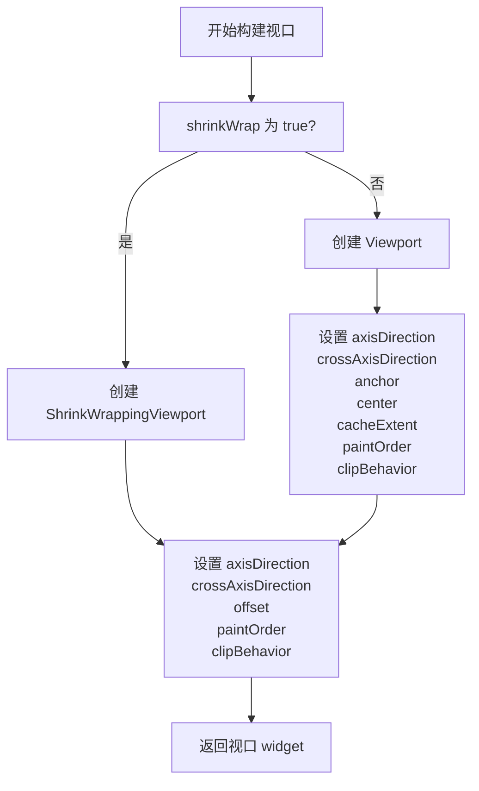

# Viewport 代码讲解

## 概述

`Viewport` 是 Flutter 滚动体系中负责“显示哪一部分内容”的核心组件，通常与 `Scrollable` 配合使用，通过 `ViewportOffset` 控制可见区域。它以一个中心 sliver 为锚点，支持在主轴前后双向布局 sliver，并可通过 `anchor` 决定零滚动偏移的位置。该文件还包含 `ShrinkWrappingViewport`，用于在主轴上按内容收缩的视口。

### 在滚动体系中的位置

- `ScrollView` 使用 `buildViewport()` 决定创建 `Viewport` 还是 `ShrinkWrappingViewport`
- `Scrollable` 提供 `ViewportOffset`（如 `ScrollPosition`），驱动视口滚动
- 各种 sliver（`SliverList`、`SliverGrid` 等）在视口内布局和绘制

## 类定义与继承关系

```dart 55:57:lib/src/widgets/viewport.dart
class Viewport extends MultiChildRenderObjectWidget {
```

`Viewport` 继承自 `MultiChildRenderObjectWidget`，内部创建 `RenderViewport` 来完成布局和绘制，适合同时管理多个 sliver 子节点。

```dart 357:370:lib/src/widgets/viewport.dart
class ShrinkWrappingViewport extends MultiChildRenderObjectWidget {
```

`ShrinkWrappingViewport` 同样继承自 `MultiChildRenderObjectWidget`，对应的渲染对象是 `RenderShrinkWrappingViewport`，特点是在主轴上根据子内容收缩尺寸。

## Viewport 构造函数与断言

```dart 63:78:lib/src/widgets/viewport.dart
Viewport({
  super.key,
  this.axisDirection = AxisDirection.down,
  this.crossAxisDirection,
  this.anchor = 0.0,
  required this.offset,
  this.center,
  this.cacheExtent,
  this.cacheExtentStyle = CacheExtentStyle.pixel,
  this.paintOrder = SliverPaintOrder.firstIsTop,
  this.clipBehavior = Clip.hardEdge,
  List<Widget> slivers = const <Widget>[],
}) : assert(center == null || slivers.where((Widget child) => child.key == center).length == 1),
     assert(cacheExtentStyle != CacheExtentStyle.viewport || cacheExtent != null),
     super(children: slivers);
```

- **axisDirection**：主轴方向，默认向下
- **crossAxisDirection**：交叉轴方向，可为空（为空时按 `Directionality` 推导）
- **anchor**：零滚动偏移的相对位置，0.0～1.0
- **offset**：视口使用的滚动偏移，通常是 `ScrollPosition`
- **center**：作为锚点的 sliver key，前后子节点分别在主轴反向和正向布局
- **cacheExtent/cacheExtentStyle**：视口外的缓存范围与单位（像素或视口倍数）
- **paintOrder**：sliver 绘制顺序，默认先到的在上
- **clipBehavior**：内容裁剪方式
- **断言**：
  - 若指定 `center`，对应 key 必须且只出现一次
  - 当 `cacheExtentStyle` 为 `viewport` 时必须提供 `cacheExtent`

## 关键属性说明

### 方向相关

```dart 79:96:lib/src/widgets/viewport.dart
final AxisDirection axisDirection;
final AxisDirection? crossAxisDirection;
```

- `axisDirection` 决定 `offset.pixels` 增长方向
- `crossAxisDirection` 若为空，垂直主轴时依赖 `Directionality`，水平主轴时默认向下

### 布局锚点

```dart 97:127:lib/src/widgets/viewport.dart
final double anchor;
final Key? center;
```

- `anchor` 控制零偏移在视口中的相对位置（例如 0.5 表示垂直居中）
- `center` 指定 `GrowthDirection.forward` 的首个 sliver，形成前后双向布局

### 滚动与缓存

```dart 108:137:lib/src/widgets/viewport.dart
final ViewportOffset offset;
final double? cacheExtent;
final CacheExtentStyle cacheExtentStyle;
```

- `offset` 提供滚动位置变化，驱动可见区域调整
- `cacheExtent` 配合 `cacheExtentStyle` 决定预渲染的范围，可提升滚动流畅度

### 绘制与裁剪

```dart 139:147:lib/src/widgets/viewport.dart
final SliverPaintOrder paintOrder;
final Clip clipBehavior;
```

- 控制 sliver 的绘制叠放顺序和视口的裁剪行为

## 核心静态方法

```dart 149:185:lib/src/widgets/viewport.dart
static AxisDirection getDefaultCrossAxisDirection(
  BuildContext context,
  AxisDirection axisDirection,
)
```

- 用于在 `crossAxisDirection` 为空时推导交叉轴方向
- 垂直主轴需依赖 `Directionality`，水平主轴默认 `AxisDirection.down`
- 含断言，确保垂直主轴下存在方向性上下文

## 渲染对象创建与更新

```dart 188:215:lib/src/widgets/viewport.dart
RenderViewport createRenderObject(BuildContext context) { ... }
void updateRenderObject(BuildContext context, RenderViewport renderObject) { ... }
```

- 创建 `RenderViewport`，传入方向、锚点、offset、缓存、绘制顺序、裁剪等
- `updateRenderObject` 保持渲染对象与 widget 参数同步，复用已有渲染对象减少重建

## 元素层逻辑：_ViewportElement

`_ViewportElement` 继承 `MultiChildRenderObjectElement`，混入 `ViewportElementMixin` 与 `NotifiableElementMixin`，主要负责在 Element 层管理 `center` 对应的渲染 sliver。

### 维护 center

```dart 270:291:lib/src/widgets/viewport.dart
void _updateCenter() {
  final Viewport viewport = widget as Viewport;
  if (viewport.center != null) {
    int elementIndex = 0;
    for (final Element e in children) {
      if (e.widget.key == viewport.center) {
        renderObject.center = e.renderObject as RenderSliver?;
        break;
      }
      elementIndex++;
    }
    assert(elementIndex < children.length);
    _centerSlotIndex = elementIndex;
  } else if (children.isNotEmpty) {
    renderObject.center = children.first.renderObject as RenderSliver?;
    _centerSlotIndex = 0;
  } else {
    renderObject.center = null;
    _centerSlotIndex = null;
  }
}
```

- 在 mount/update 后定位 `center` 对应的子元素，确保 `RenderViewport.center` 指向正确的 `RenderSliver`
- 若未指定 `center`，默认使用第一个子元素
- 缓存 `_centerSlotIndex`，配合插入/移除时同步中心指针

### 子节点插入与可见性

```dart 294:329:lib/src/widgets/viewport.dart
void insertRenderObjectChild(RenderObject child, IndexedSlot<Element?> slot) { ... }
void debugVisitOnstageChildren(ElementVisitor visitor) { ... }
```

- 插入时若命中中心槽位，立即更新 `renderObject.center`
- `debugVisitOnstageChildren` 仅遍历 `geometry.visible` 为真的 sliver，便于调试可见子树

## ShrinkWrappingViewport 亮点

构造函数简单，仅接收方向、offset、绘制与裁剪配置；与 `Viewport` 不同点：

- 主轴尺寸由子内容决定，适用于无界约束场景（如嵌套在 `Column`、`Row`）
- 不支持 `anchor`、`center`、`cacheExtent`，逻辑更轻量
- 绑定的渲染对象为 `RenderShrinkWrappingViewport`

## Viewport 与 ShrinkWrappingViewport 差异

| 特性 | Viewport | ShrinkWrappingViewport |
|------|----------|------------------------|
| 主轴尺寸 | 填满约束 | 随子内容收缩 |
| 锚点/中心 | 支持 `anchor` 与 `center` | 不支持 |
| 缓存 | 支持 `cacheExtent` 与单位 | 不支持 |
| 使用场景 | 常规滚动视口 | 无界主轴、需要按内容收缩 |
| 性能 | 更高效 | 可能频繁重算尺寸，开销更大 |

## 构建流程示意

以下流程描述 `ScrollView.buildViewport()` 选择并配置视口的典型步骤：



## 使用与调试要点

- 在需要双向 sliver 布局或精确控制零偏移位置时使用 `Viewport`
- 在无界主轴或需要“内容决定尺寸”时使用 `ShrinkWrappingViewport`，但要注意性能
- 设置 `center` 时务必为目标 sliver 提供唯一 key
- 若使用 `cacheExtentStyle.viewport`，必须提供 `cacheExtent`
- 调试可见子树时可依赖 `_ViewportElement.debugVisitOnstageChildren` 的可见性过滤

## 参考资源

- [RenderViewport 文档](https://api.flutter.dev/flutter/rendering/RenderViewport-class.html)
- [RenderShrinkWrappingViewport 文档](https://api.flutter.dev/flutter/rendering/RenderShrinkWrappingViewport-class.html)
- [Viewport 官方文档](https://api.flutter.dev/flutter/widgets/Viewport-class.html)
- [ShrinkWrappingViewport 官方文档](https://api.flutter.dev/flutter/widgets/ShrinkWrappingViewport-class.html)
