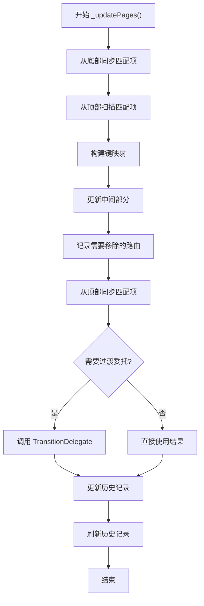

# NavigatorState 历史记录更新机制详解

## 概述

`_updatePages()` 是 `NavigatorState` 中最复杂的方法，负责同步 `widget.pages` 列表和路由历史记录 `_history`。它实现了类似 `RenderObjectElement.updateChildren` 的差异算法，用于高效地更新路由栈。

## 方法签名

```dart 4095:4095:packages/flutter/lib/src/widgets/navigator.dart
  void _updatePages() {
```

## 核心算法概述

该方法采用**双向扫描 + 中间匹配**的策略：

1. **从底部同步**：从列表底部开始，同步可以匹配的节点
2. **从顶部扫描**：从列表顶部开始，扫描可以匹配的节点（但不立即同步）
3. **中间部分处理**：处理中间不匹配的部分，创建新路由或匹配已有路由
4. **从顶部同步**：同步顶部可以匹配的节点
5. **使用过渡委托**：让 `TransitionDelegate` 决定路由的进入和退出方式
6. **填充无页面路由**：将无页面路由填充回新的历史记录

## 详细流程分析

### 阶段 1：初始化和断言

```dart 4096:4101:packages/flutter/lib/src/widgets/navigator.dart
    assert(() {
      assert(!_debugUpdatingPage);
      _debugCheckDuplicatedPageKeys();
      _debugUpdatingPage = true;
      return true;
    }());
```

- **防止重入**：确保不会同时执行多个更新
- **检查重复键**：确保页面列表中没有重复的 key
- **设置更新标志**：标记正在更新页面

### 阶段 2：算法说明注释

```dart 4103:4139:packages/flutter/lib/src/widgets/navigator.dart
    // This attempts to diff the new pages list (widget.pages) with
    // the old _RouteEntry(s) list (_history), and produces a new list of
    // _RouteEntry(s) to be the new list of _history. This method roughly
    // follows the same outline of RenderObjectElement.updateChildren.
    //
    // The cases it tries to optimize for are:
    //  - the old list is empty
    //  - All the pages in the new list can match the page-based routes in the old
    //    list, and their orders are the same.
    //  - there is an insertion or removal of one or more page-based route in
    //    only one place in the list
    // If a page-based route with a key is in both lists, it will be synced.
    // Page-based routes without keys might be synced but there is no guarantee.

    // The general approach is to sync the entire new list backwards, as follows:
    // 1. Walk the lists from the bottom, syncing nodes, and record pageless routes,
    //    until you no longer have matching nodes.
    // 2. Walk the lists from the top, without syncing nodes, until you no
    //    longer have matching nodes. We'll sync these nodes at the end. We
    //    don't sync them now because we want to sync all the nodes in order
    //    from beginning to end.
    // At this point we narrowed the old and new lists to the point
    // where the nodes no longer match.
    // 3. Walk the narrowed part of the old list to get the list of
    //    keys.
    // 4. Walk the narrowed part of the new list forwards:
    //     * Create a new _RouteEntry for non-keyed items and record them for
    //       transitionDelegate.
    //     * Sync keyed items with the source if it exists.
    // 5. Walk the narrowed part of the old list again to records the
    //    _RouteEntry(s), as well as pageless routes, needed to be removed for
    //    transitionDelegate.
    // 5. Walk the top of the list again, syncing the nodes and recording
    //    pageless routes.
    // 6. Use transitionDelegate for explicit decisions on how _RouteEntry(s)
    //    transition in or off the screens.
    // 7. Fill pageless routes back into the new history.
```

### 阶段 3：初始化变量

```dart 4141:4149:packages/flutter/lib/src/widgets/navigator.dart
    bool needsExplicitDecision = false;
    int newPagesBottom = 0;
    int oldEntriesBottom = 0;
    int newPagesTop = widget.pages.length - 1;
    int oldEntriesTop = _history.length - 1;

    final List<_RouteEntry> newHistory = <_RouteEntry>[];
    final Map<_RouteEntry?, List<_RouteEntry>> pageRouteToPagelessRoutes =
        <_RouteEntry?, List<_RouteEntry>>{};
```

- **needsExplicitDecision**：是否需要过渡委托做决策
- **newPagesBottom/Top**：新页面列表的底部和顶部索引
- **oldEntriesBottom/Top**：旧历史记录的底部和顶部索引
- **newHistory**：新的历史记录列表
- **pageRouteToPagelessRoutes**：页面路由到无页面路由的映射

### 阶段 4：从底部同步

```dart 4151:4179:packages/flutter/lib/src/widgets/navigator.dart
    // Updates the bottom of the list.
    _RouteEntry? previousOldPageRouteEntry;
    while (oldEntriesBottom <= oldEntriesTop) {
      final _RouteEntry oldEntry = _history[oldEntriesBottom];
      assert(oldEntry.currentState != _RouteLifecycle.disposed);
      // Records pageless route. The bottom most pageless routes will be
      // stored in key = null.
      if (!oldEntry.pageBased) {
        final List<_RouteEntry> pagelessRoutes = pageRouteToPagelessRoutes.putIfAbsent(
          previousOldPageRouteEntry,
          () => <_RouteEntry>[],
        );
        pagelessRoutes.add(oldEntry);
        oldEntriesBottom += 1;
        continue;
      }
      if (newPagesBottom > newPagesTop) {
        break;
      }
      final Page<dynamic> newPage = widget.pages[newPagesBottom];
      if (!oldEntry.canUpdateFrom(newPage)) {
        break;
      }
      previousOldPageRouteEntry = oldEntry;
      oldEntry.route._updateSettings(newPage);
      newHistory.add(oldEntry);
      newPagesBottom += 1;
      oldEntriesBottom += 1;
    }
```

**逻辑说明**：

1. **处理无页面路由**：将无页面路由记录到映射中，键为 `null`（最底部的无页面路由）
2. **检查边界**：如果新页面列表已处理完，退出循环
3. **匹配检查**：使用 `canUpdateFrom` 检查旧路由是否可以更新为新页面
4. **同步匹配项**：如果可以匹配，更新路由设置并添加到新历史记录

### 阶段 5：从顶部扫描

```dart 4181:4211:packages/flutter/lib/src/widgets/navigator.dart
    final List<_RouteEntry> unattachedPagelessRoutes = <_RouteEntry>[];
    // Scans the top of the list until we found a page-based route that cannot be
    // updated.
    while ((oldEntriesBottom <= oldEntriesTop) && (newPagesBottom <= newPagesTop)) {
      final _RouteEntry oldEntry = _history[oldEntriesTop];
      assert(oldEntry.currentState != _RouteLifecycle.disposed);
      if (!oldEntry.pageBased) {
        unattachedPagelessRoutes.add(oldEntry);
        oldEntriesTop -= 1;
        continue;
      }
      final Page<dynamic> newPage = widget.pages[newPagesTop];
      if (!oldEntry.canUpdateFrom(newPage)) {
        break;
      }

      // We found the page for all the consecutive pageless routes below. Attach these
      // pageless routes to the page.
      if (unattachedPagelessRoutes.isNotEmpty) {
        pageRouteToPagelessRoutes.putIfAbsent(
          oldEntry,
          () => List<_RouteEntry>.of(unattachedPagelessRoutes),
        );
        unattachedPagelessRoutes.clear();
      }

      oldEntriesTop -= 1;
      newPagesTop -= 1;
    }
    // Reverts the pageless routes that cannot be updated.
    oldEntriesTop += unattachedPagelessRoutes.length;
```

**逻辑说明**：

1. **收集未附加的无页面路由**：临时存储无法立即附加的无页面路由
2. **从顶部扫描**：检查顶部是否可以匹配
3. **处理无页面路由**：如果找到匹配的页面路由，将无页面路由附加到它
4. **回退处理**：如果无法匹配，回退无页面路由

### 阶段 6：构建键映射

```dart 4213:4240:packages/flutter/lib/src/widgets/navigator.dart
    // Scans middle of the old entries and records the page key to old entry map.
    int oldEntriesBottomToScan = oldEntriesBottom;
    final Map<LocalKey, _RouteEntry> pageKeyToOldEntry = <LocalKey, _RouteEntry>{};
    // This set contains entries that are transitioning out but are still in
    // the route stack.
    final Set<_RouteEntry> phantomEntries = <_RouteEntry>{};
    while (oldEntriesBottomToScan <= oldEntriesTop) {
      final _RouteEntry oldEntry = _history[oldEntriesBottomToScan];
      oldEntriesBottomToScan += 1;
      assert(oldEntry.currentState != _RouteLifecycle.disposed);
      // Pageless routes will be recorded when we update the middle of the old
      // list.
      if (!oldEntry.pageBased) {
        continue;
      }

      final Page<dynamic> page = oldEntry.route.settings as Page<dynamic>;
      if (page.key == null) {
        continue;
      }

      if (!oldEntry.willBePresent) {
        phantomEntries.add(oldEntry);
        continue;
      }
      assert(!pageKeyToOldEntry.containsKey(page.key));
      pageKeyToOldEntry[page.key!] = oldEntry;
    }
```

**逻辑说明**：

1. **扫描中间部分**：扫描旧历史记录的中间部分（未匹配的部分）
2. **构建键映射**：将页面 key 映射到旧路由条目
3. **处理幻影条目**：记录正在退出但仍未完全移除的路由
4. **跳过无页面路由**：无页面路由稍后处理

### 阶段 7：更新中间部分

```dart 4242:4271:packages/flutter/lib/src/widgets/navigator.dart
    // Updates the middle of the list.
    while (newPagesBottom <= newPagesTop) {
      final Page<dynamic> nextPage = widget.pages[newPagesBottom];
      newPagesBottom += 1;
      if (nextPage.key == null ||
          !pageKeyToOldEntry.containsKey(nextPage.key) ||
          !pageKeyToOldEntry[nextPage.key]!.canUpdateFrom(nextPage)) {
        // There is no matching key in the old history, we need to create a new
        // route and wait for the transition delegate to decide how to add
        // it into the history.
        final _RouteEntry newEntry = _RouteEntry(
          nextPage.createRoute(context),
          pageBased: true,
          initialState: _RouteLifecycle.staging,
        );
        needsExplicitDecision = true;
        assert(
          newEntry.route.settings == nextPage,
          'The settings getter of a page-based Route must return a Page object. '
          'Please set the settings to the Page in the Page.createRoute method.',
        );
        newHistory.add(newEntry);
      } else {
        // Removes the key from pageKeyToOldEntry to indicate it is taken.
        final _RouteEntry matchingEntry = pageKeyToOldEntry.remove(nextPage.key)!;
        assert(matchingEntry.canUpdateFrom(nextPage));
        matchingEntry.route._updateSettings(nextPage);
        newHistory.add(matchingEntry);
      }
    }
```

**逻辑说明**：

1. **处理新页面**：遍历中间部分的新页面
2. **创建新路由**：如果没有匹配的旧路由，创建新的路由条目（状态为 `staging`）
3. **匹配旧路由**：如果有匹配的旧路由，更新其设置并添加到新历史记录
4. **标记需要决策**：创建新路由时需要过渡委托决策

### 阶段 8：记录需要移除的路由

```dart 4273:4309:packages/flutter/lib/src/widgets/navigator.dart
    // Any remaining old routes that do not have a match will need to be removed.
    final Map<RouteTransitionRecord?, RouteTransitionRecord> locationToExitingPageRoute =
        <RouteTransitionRecord?, RouteTransitionRecord>{};
    while (oldEntriesBottom <= oldEntriesTop) {
      final _RouteEntry potentialEntryToRemove = _history[oldEntriesBottom];
      oldEntriesBottom += 1;

      if (!potentialEntryToRemove.pageBased) {
        assert(previousOldPageRouteEntry != null);
        final List<_RouteEntry> pagelessRoutes = pageRouteToPagelessRoutes.putIfAbsent(
          previousOldPageRouteEntry,
          () => <_RouteEntry>[],
        );
        pagelessRoutes.add(potentialEntryToRemove);
        if (previousOldPageRouteEntry!.isWaitingForExitingDecision &&
            potentialEntryToRemove.willBePresent) {
          potentialEntryToRemove.markNeedsExitingDecision();
        }
        continue;
      }

      final Page<dynamic> potentialPageToRemove =
          potentialEntryToRemove.route.settings as Page<dynamic>;
      // Marks for transition delegate to remove if this old page does not have
      // a key, was not taken during updating the middle of new page, or is
      // already transitioning out.
      if (potentialPageToRemove.key == null ||
          pageKeyToOldEntry.containsKey(potentialPageToRemove.key) ||
          phantomEntries.contains(potentialEntryToRemove)) {
        locationToExitingPageRoute[previousOldPageRouteEntry] = potentialEntryToRemove;
        // We only need a decision if it has not already been popped.
        if (potentialEntryToRemove.willBePresent) {
          potentialEntryToRemove.markNeedsExitingDecision();
        }
      }
      previousOldPageRouteEntry = potentialEntryToRemove;
    }
```

**逻辑说明**：

1. **处理无页面路由**：将无页面路由附加到前一个页面路由
2. **标记需要移除的路由**：记录需要过渡委托决定如何移除的路由
3. **检查移除条件**：无 key、未被匹配或正在退出

### 阶段 9：验证和从顶部同步

```dart 4311:4348:packages/flutter/lib/src/widgets/navigator.dart
    // We've scanned the whole list.
    assert(oldEntriesBottom == oldEntriesTop + 1);
    assert(newPagesBottom == newPagesTop + 1);
    newPagesTop = widget.pages.length - 1;
    oldEntriesTop = _history.length - 1;
    // Verifies we either reach the bottom or the oldEntriesBottom must be updatable
    // by newPagesBottom.
    assert(() {
      if (oldEntriesBottom <= oldEntriesTop) {
        return newPagesBottom <= newPagesTop &&
            _history[oldEntriesBottom].pageBased &&
            _history[oldEntriesBottom].canUpdateFrom(widget.pages[newPagesBottom]);
      } else {
        return newPagesBottom > newPagesTop;
      }
    }());

    // Updates the top of the list.
    while ((oldEntriesBottom <= oldEntriesTop) && (newPagesBottom <= newPagesTop)) {
      final _RouteEntry oldEntry = _history[oldEntriesBottom];
      assert(oldEntry.currentState != _RouteLifecycle.disposed);
      if (!oldEntry.pageBased) {
        assert(previousOldPageRouteEntry != null);
        final List<_RouteEntry> pagelessRoutes = pageRouteToPagelessRoutes.putIfAbsent(
          previousOldPageRouteEntry,
          () => <_RouteEntry>[],
        );
        pagelessRoutes.add(oldEntry);
        continue;
      }
      previousOldPageRouteEntry = oldEntry;
      final Page<dynamic> newPage = widget.pages[newPagesBottom];
      assert(oldEntry.canUpdateFrom(newPage));
      oldEntry.route._updateSettings(newPage);
      newHistory.add(oldEntry);
      oldEntriesBottom += 1;
      newPagesBottom += 1;
    }
```

**逻辑说明**：

1. **验证完整性**：确保已扫描完整个列表
2. **从顶部同步**：同步顶部可以匹配的节点
3. **处理无页面路由**：将无页面路由附加到页面路由

### 阶段 10：使用过渡委托

```dart 4350:4361:packages/flutter/lib/src/widgets/navigator.dart
    // Finally, uses transition delegate to make explicit decision if needed.
    needsExplicitDecision = needsExplicitDecision || locationToExitingPageRoute.isNotEmpty;
    Iterable<_RouteEntry> results = newHistory;
    if (needsExplicitDecision) {
      results = widget.transitionDelegate
          ._transition(
            newPageRouteHistory: newHistory,
            locationToExitingPageRoute: locationToExitingPageRoute,
            pageRouteToPagelessRoutes: pageRouteToPagelessRoutes,
          )
          .cast<_RouteEntry>();
    }
```

**逻辑说明**：

1. **检查是否需要决策**：有新路由或需要移除的路由
2. **调用过渡委托**：让 `TransitionDelegate` 决定路由的进入和退出方式
3. **获取结果**：获取处理后的路由列表

### 阶段 11：更新历史记录

```dart 4362:4372:packages/flutter/lib/src/widgets/navigator.dart
    _history.clear();
    // Adds the leading pageless routes if there is any.
    if (pageRouteToPagelessRoutes.containsKey(null)) {
      _history.addAll(pageRouteToPagelessRoutes[null]!);
    }
    for (final _RouteEntry result in results) {
      _history.add(result);
      if (pageRouteToPagelessRoutes.containsKey(result)) {
        _history.addAll(pageRouteToPagelessRoutes[result]!);
      }
    }
```

**逻辑说明**：

1. **清空旧历史**：清空当前历史记录
2. **添加前导无页面路由**：添加最底部的无页面路由
3. **添加路由结果**：添加过渡委托处理后的路由
4. **附加无页面路由**：为每个页面路由附加其无页面路由

### 阶段 12：刷新和清理

```dart 4373:4386:packages/flutter/lib/src/widgets/navigator.dart
    assert(() {
      _debugUpdatingPage = false;
      return true;
    }());
    assert(() {
      _debugLocked = true;
      return true;
    }());
    _flushHistoryUpdates();
    assert(() {
      _debugLocked = false;
      return true;
    }());
  }
```

**逻辑说明**：

1. **重置更新标志**：标记更新完成
2. **锁定导航器**：防止并发操作
3. **刷新历史记录**：应用所有更改
4. **解锁导航器**：允许后续操作

## 算法流程图



## 关键概念

### 1. 页面路由 vs 无页面路由

- **页面路由（page-based）**：来自 `widget.pages` 的路由
- **无页面路由（pageless）**：通过命令式 API（如 `push`）添加的路由

### 2. 路由匹配

使用 `canUpdateFrom` 方法判断旧路由是否可以更新为新页面：

- 有 key 的路由：通过 key 匹配
- 无 key 的路由：通过位置和类型匹配

### 3. 过渡委托

`TransitionDelegate` 决定路由的进入和退出方式：

- 新路由如何进入
- 旧路由如何退出
- 转场动画的类型

## 优化策略

1. **双向扫描**：从底部和顶部同时扫描，减少中间部分的处理量
2. **键匹配**：优先使用 key 进行精确匹配
3. **延迟同步**：顶部匹配项延迟同步，保证顺序
4. **批量处理**：使用过渡委托批量处理路由变化

## 注意事项

1. **无页面路由处理**：无页面路由必须附加到页面路由
2. **状态一致性**：确保路由状态在整个过程中保持一致
3. **过渡委托必需**：复杂变化必须通过过渡委托处理
4. **性能考虑**：算法复杂度为 O(n)，适合大多数场景

## 相关文档

- [NavigatorState 历史记录刷新机制](navigator.dart_NavigatorState_4_历史记录刷新机制.md)
- [NavigatorState 生命周期管理](navigator.dart_NavigatorState_2_生命周期管理.md)
- [Navigator 概述与使用指南](navigator.dart_Navigator_1_概述与使用指南.md)
