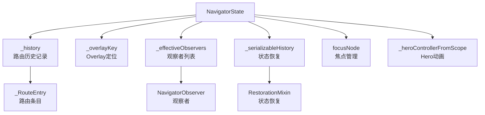

# NavigatorState 类定义与核心属性

## 概述

`NavigatorState` 是 `Navigator` widget 的状态类，负责管理路由栈、处理导航操作和维护路由历史记录。本文档介绍 `NavigatorState` 类的定义和核心属性。

## 类定义

```dart 3674:3677:packages/flutter/lib/src/widgets/navigator.dart
/// The state for a [Navigator] widget.
///
/// A reference to this class can be obtained by calling [Navigator.of].
class NavigatorState extends State<Navigator> with TickerProviderStateMixin, RestorationMixin {
```

### 类继承关系

- **继承自**：`State<Navigator>` - Flutter 标准状态类
- **混入**：
  - `TickerProviderStateMixin` - 提供动画控制器支持，用于路由转场动画
  - `RestorationMixin` - 提供状态恢复支持，用于应用重启后恢复路由状态

### 获取 NavigatorState 实例

可以通过 `Navigator.of(context)` 获取当前 `NavigatorState` 实例，这是访问导航器的主要方式。

## 核心属性

### 1. Overlay 相关

```dart 3678:3678:packages/flutter/lib/src/widgets/navigator.dart
  late GlobalKey<OverlayState> _overlayKey;
```

- **作用**：用于定位和管理 `Overlay` widget，所有路由都通过 `Overlay` 进行渲染
- **类型**：`GlobalKey<OverlayState>` - 全局键，用于在 widget 树中定位 `Overlay`
- **初始化**：在 `restoreState` 方法中初始化

### 2. 路由历史记录

```dart 3679:3679:packages/flutter/lib/src/widgets/navigator.dart
  final _History _history = _History();
```

- **作用**：存储所有路由条目的历史记录，是导航器的核心数据结构
- **类型**：`_History` - 内部历史记录类，维护路由栈
- **特点**：不可变引用，但内容可变

### 3. 等待销毁的路由条目

```dart 3681:3689:packages/flutter/lib/src/widgets/navigator.dart
  /// A set for entries that are waiting to dispose until their subtrees are
  /// disposed.
  ///
  /// These entries are not considered to be in the _history and will usually
  /// remove themselves from this set once they can dispose.
  ///
  /// The navigator keep track of these entries so that, in case the navigator
  /// itself is disposed, it can dispose these entries immediately.
  final Set<_RouteEntry> _entryWaitingForSubTreeDisposal = <_RouteEntry>{};
```

- **作用**：存储等待子树销毁后才能销毁的路由条目
- **场景**：某些路由需要等待其子树完全销毁后才能安全销毁
- **清理**：当导航器被销毁时，会立即销毁这些条目

### 4. 状态恢复相关

```dart 3690:3690:packages/flutter/lib/src/widgets/navigator.dart
  final _HistoryProperty _serializableHistory = _HistoryProperty();
```

- **作用**：用于序列化和恢复路由历史记录
- **用途**：应用重启后恢复之前的导航状态
- **机制**：与 `RestorationMixin` 配合工作

### 5. 观察者通知队列

```dart 3691:3692:packages/flutter/lib/src/widgets/navigator.dart
  final Queue<_NavigatorObservation> _observedRouteAdditions = Queue<_NavigatorObservation>();
  final Queue<_NavigatorObservation> _observedRouteDeletions = Queue<_NavigatorObservation>();
```

- **作用**：存储待通知的路由添加和删除事件
- **类型**：`Queue<_NavigatorObservation>` - 队列结构，保证通知顺序
- **处理**：在 `_flushObserverNotifications` 方法中批量处理

### 6. 焦点管理

```dart 3694:3695:packages/flutter/lib/src/widgets/navigator.dart
  /// The [FocusNode] for the [Focus] that encloses the routes.
  final FocusNode focusNode = FocusNode(debugLabel: 'Navigator');
```

- **作用**：管理导航器的焦点状态
- **用途**：处理键盘导航和焦点遍历
- **标签**：调试标签为 "Navigator"

### 7. 调试锁

```dart 3697:3697:packages/flutter/lib/src/widgets/navigator.dart
  bool _debugLocked = false; // used to prevent re-entrant calls to push, pop, and friends
```

- **作用**：防止重入调用，确保导航操作的原子性
- **使用场景**：在执行 `push`、`pop` 等操作时锁定，防止并发操作
- **注意**：仅在调试模式下使用

### 8. Hero 控制器

```dart 3699:3699:packages/flutter/lib/src/widgets/navigator.dart
  HeroController? _heroControllerFromScope;
```

- **作用**：从 `HeroControllerScope` 获取的 Hero 动画控制器
- **用途**：管理路由之间的 Hero 转场动画
- **更新**：在 `didChangeDependencies` 和 `initState` 中更新

### 9. 有效观察者列表

```dart 3701:3701:packages/flutter/lib/src/widgets/navigator.dart
  late List<NavigatorObserver> _effectiveObservers;
```

- **作用**：存储所有有效的导航观察者
- **组成**：包括 widget 的观察者和 HeroController（如果存在）
- **更新**：在 `_updateEffectiveObservers` 方法中更新

### 10. Pages API 判断

```dart 3703:3703:packages/flutter/lib/src/widgets/navigator.dart
  bool get _usingPagesAPI => widget.pages != const <Page<dynamic>>[];
```

- **作用**：判断是否使用 Pages API（声明式导航）
- **返回**：如果 `widget.pages` 不为空，返回 `true`
- **用途**：区分声明式导航和命令式导航

## 属性关系图



## 关键设计要点

### 1. 历史记录管理

`_history` 是导航器的核心，所有路由操作都围绕它进行：

- 路由入栈：添加到 `_history`
- 路由出栈：从 `_history` 移除
- 路由替换：更新 `_history` 中的条目

### 2. 观察者模式

通过 `_effectiveObservers` 和通知队列实现观察者模式：

- 路由变化时通知所有观察者
- 使用队列保证通知顺序
- 支持 HeroController 作为特殊观察者

### 3. 状态恢复

通过 `_serializableHistory` 和 `RestorationMixin` 实现状态恢复：

- 序列化路由历史记录
- 应用重启后恢复导航状态
- 支持命名路由和匿名路由的恢复

### 4. 线程安全

通过 `_debugLocked` 防止重入调用：

- 确保导航操作的原子性
- 防止并发修改路由栈
- 仅在调试模式下生效

## 使用示例

### 获取 NavigatorState

```dart
// 获取当前导航器
final NavigatorState navigator = Navigator.of(context);

// 获取根导航器
final NavigatorState rootNavigator = Navigator.of(context, rootNavigator: true);
```

### 访问核心属性

```dart
// 检查是否可以使用 Pages API
if (navigator._usingPagesAPI) {
  // 使用声明式导航
}

// 访问 Overlay
final OverlayState? overlay = navigator.overlay;
```

## 注意事项

1. **不要直接修改 `_history`**：应该通过公共方法（如 `push`、`pop`）操作路由栈
2. **观察者生命周期**：观察者会在导航器销毁时自动清理
3. **状态恢复限制**：只有可序列化的路由才能被恢复
4. **焦点管理**：导航器会自动管理焦点，通常不需要手动操作

## 相关文档

- [NavigatorState 生命周期管理](navigator.dart_NavigatorState_2_生命周期管理.md)
- [NavigatorState 历史记录更新机制](navigator.dart_NavigatorState_3_历史记录更新机制.md)
- [Navigator 概述与使用指南](navigator.dart_Navigator_1_概述与使用指南.md)
