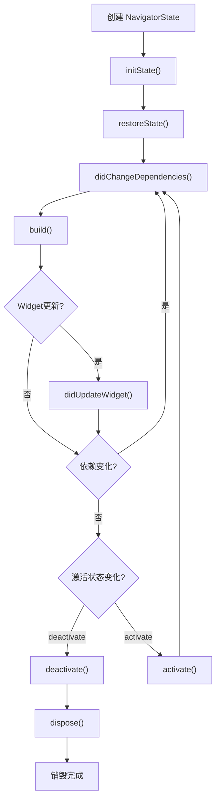
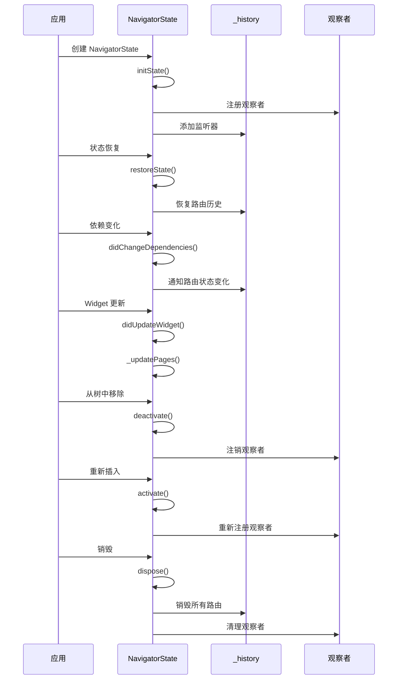

# NavigatorState 生命周期管理

## 概述

`NavigatorState` 作为 `State` 的子类，需要管理完整的生命周期。本文档详细介绍 `NavigatorState` 的生命周期方法，包括初始化、状态恢复、依赖更新、widget 更新和销毁等关键阶段。

## 生命周期方法概览



## 1. initState - 初始化

```dart 3765:3789:packages/flutter/lib/src/widgets/navigator.dart
  @protected
  @override
  void initState() {
    super.initState();
    assert(_debugCheckPageApiParameters());
    for (final NavigatorObserver observer in widget.observers) {
      assert(observer.navigator == null);
      NavigatorObserver._navigators[observer] = this;
    }
    _effectiveObservers = widget.observers;

    // We have to manually extract the inherited widget in initState because
    // the current context is not fully initialized.
    final HeroControllerScope? heroControllerScope =
        context.getElementForInheritedWidgetOfExactType<HeroControllerScope>()?.widget
            as HeroControllerScope?;
    _updateHeroController(heroControllerScope?.controller);

    if (widget.reportsRouteUpdateToEngine) {
      SystemNavigator.selectSingleEntryHistory();
    }

    ServicesBinding.instance.accessibilityFocus.addListener(_recordLastFocus);
    _history.addListener(_handleHistoryChanged);
  }
```

### 功能说明

1. **检查 Pages API 参数**：验证 Pages API 的配置是否正确
2. **注册观察者**：将所有 `NavigatorObserver` 注册到当前导航器
3. **初始化有效观察者**：设置初始观察者列表
4. **获取 HeroController**：从 `HeroControllerScope` 获取 Hero 控制器
5. **系统导航配置**：如果启用路由更新报告，配置系统导航
6. **注册监听器**：
   - 可访问性焦点监听器
   - 历史记录变化监听器

### 关键点

- **手动获取 InheritedWidget**：因为 `context` 在 `initState` 中未完全初始化，需要手动提取
- **观察者唯一性**：确保每个观察者只属于一个导航器
- **监听器注册**：为后续的状态变化通知做准备

## 2. restoreState - 状态恢复

```dart 3802:3875:packages/flutter/lib/src/widgets/navigator.dart
  @protected
  @override
  void restoreState(RestorationBucket? oldBucket, bool initialRestore) {
    registerForRestoration(_rawNextPagelessRestorationScopeId, 'id');
    registerForRestoration(_serializableHistory, 'history');

    // Delete everything in the old history and clear the overlay.
    _forcedDisposeAllRouteEntries();
    assert(_history.isEmpty);
    _overlayKey = GlobalKey<OverlayState>();

    // Populate the new history from restoration data.
    _history.addAll(_serializableHistory.restoreEntriesForPage(null, this));
    for (final Page<dynamic> page in widget.pages) {
      final _RouteEntry entry = _RouteEntry(
        page.createRoute(context),
        pageBased: true,
        initialState: _RouteLifecycle.add,
      );
      assert(
        entry.route.settings == page,
        'The settings getter of a page-based Route must return a Page object. '
        'Please set the settings to the Page in the Page.createRoute method.',
      );
      _history.add(entry);
      _history.addAll(_serializableHistory.restoreEntriesForPage(entry, this));
    }

    // If there was nothing to restore, we need to process the initial route.
    if (!_serializableHistory.hasData) {
      String? initialRoute = widget.initialRoute;
      if (widget.pages.isEmpty) {
        initialRoute ??= Navigator.defaultRouteName;
      }
      if (initialRoute != null) {
        _history.addAll(
          widget
              .onGenerateInitialRoutes(this, widget.initialRoute ?? Navigator.defaultRouteName)
              .map(
                (Route<dynamic> route) => _RouteEntry(
                  route,
                  pageBased: false,
                  initialState: _RouteLifecycle.add,
                  restorationInformation: route.settings.name != null
                      ? _RestorationInformation.named(
                          name: route.settings.name!,
                          arguments: null,
                          restorationScopeId: _nextPagelessRestorationScopeId,
                        )
                      : null,
                ),
              ),
        );
      }
    }

    assert(
      _history.isNotEmpty,
      'All routes returned by onGenerateInitialRoutes are not restorable. '
      'Please make sure that all routes returned by onGenerateInitialRoutes '
      'have their RouteSettings defined with names that are defined in the '
      "app's routes table.",
    );
    assert(!_debugLocked);
    assert(() {
      _debugLocked = true;
      return true;
    }());
    _flushHistoryUpdates();
    assert(() {
      _debugLocked = false;
      return true;
    }());
  }
```

### 功能说明

1. **注册恢复数据**：
   - 注册无页面路由的恢复作用域 ID
   - 注册可序列化的历史记录

2. **清理旧状态**：
   - 强制销毁所有旧路由条目
   - 重新创建 `_overlayKey`

3. **恢复路由历史**：
   - 从恢复数据中恢复无页面路由
   - 为每个 `Page` 创建路由条目
   - 恢复每个页面下的无页面路由

4. **处理初始路由**：
   - 如果没有恢复数据，处理初始路由
   - 使用 `onGenerateInitialRoutes` 生成初始路由

5. **刷新历史记录**：调用 `_flushHistoryUpdates` 应用所有更改

### 关键点

- **状态清理**：必须先清理旧状态，再恢复新状态
- **路由类型**：区分页面路由（page-based）和无页面路由（pageless）
- **恢复信息**：只有命名路由才能被恢复

## 3. didChangeDependencies - 依赖变化

```dart 3891:3901:packages/flutter/lib/src/widgets/navigator.dart
  @protected
  @override
  void didChangeDependencies() {
    super.didChangeDependencies();
    _updateHeroController(HeroControllerScope.maybeOf(context));
    for (final _RouteEntry entry in _history) {
      if (entry.route.navigator == this) {
        entry.route.changedExternalState();
      }
    }
  }
```

### 功能说明

1. **更新 HeroController**：从新的 context 中获取 HeroController
2. **通知路由外部状态变化**：通知所有路由外部状态已变化

### 触发时机

- InheritedWidget 变化时
- 导航器在 widget 树中的位置变化时

## 4. didUpdateWidget - Widget 更新

```dart 3985:4024:packages/flutter/lib/src/widgets/navigator.dart
  @protected
  @override
  void didUpdateWidget(Navigator oldWidget) {
    super.didUpdateWidget(oldWidget);
    assert(_debugCheckPageApiParameters());
    if (oldWidget.observers != widget.observers) {
      for (final NavigatorObserver observer in oldWidget.observers) {
        NavigatorObserver._navigators[observer] = null;
      }
      for (final NavigatorObserver observer in widget.observers) {
        assert(observer.navigator == null);
        NavigatorObserver._navigators[observer] = this;
      }
      _updateEffectiveObservers();
    }
    if (oldWidget.pages != widget.pages && !restorePending) {
      assert(() {
        if (widget.pages.isEmpty) {
          FlutterError.reportError(
            FlutterErrorDetails(
              exception: FlutterError(
                'The Navigator.pages must not be empty to use the '
                'Navigator.pages API',
              ),
              library: 'widget library',
              stack: StackTrace.current,
            ),
          );
        }
        return true;
      }());
      _updatePages();
    }

    for (final _RouteEntry entry in _history) {
      if (entry.route.navigator == this) {
        entry.route.changedExternalState();
      }
    }
  }
```

### 功能说明

1. **检查 Pages API 参数**：验证配置是否正确
2. **更新观察者**：
   - 注销旧观察者
   - 注册新观察者
   - 更新有效观察者列表
3. **更新页面列表**：
   - 如果 `pages` 发生变化且不在恢复过程中，调用 `_updatePages()`
   - 这是 Pages API 的核心更新机制
4. **通知路由状态变化**：通知所有路由外部状态已变化

### 关键点

- **观察者管理**：确保观察者正确注册和注销
- **Pages API 更新**：通过 `_updatePages()` 同步页面列表和路由栈
- **恢复状态检查**：在恢复过程中不更新页面列表

## 5. deactivate - 停用

```dart 4040:4048:packages/flutter/lib/src/widgets/navigator.dart
  @protected
  @override
  void deactivate() {
    for (final NavigatorObserver observer in _effectiveObservers) {
      NavigatorObserver._navigators[observer] = null;
    }
    _effectiveObservers = <NavigatorObserver>[];
    super.deactivate();
  }
```

### 功能说明

1. **注销所有观察者**：将观察者从导航器映射中移除
2. **清空观察者列表**：防止内存泄漏
3. **调用父类方法**：完成标准的停用流程

### 触发时机

- 导航器从 widget 树中移除时
- 可能稍后重新插入（activate）

## 6. activate - 激活

```dart 4050:4059:packages/flutter/lib/src/widgets/navigator.dart
  @protected
  @override
  void activate() {
    super.activate();
    _updateEffectiveObservers();
    for (final NavigatorObserver observer in _effectiveObservers) {
      assert(observer.navigator == null);
      NavigatorObserver._navigators[observer] = this;
    }
  }
```

### 功能说明

1. **更新有效观察者**：重新计算有效观察者列表
2. **重新注册观察者**：将观察者重新注册到当前导航器

### 触发时机

- 导航器重新插入到 widget 树时
- 在 `deactivate` 之后

## 7. dispose - 销毁

```dart 4061:4082:packages/flutter/lib/src/widgets/navigator.dart
  @protected
  @override
  void dispose() {
    assert(!_debugLocked);
    assert(() {
      _debugLocked = true;
      return true;
    }());
    assert(_effectiveObservers.isEmpty);
    _updateHeroController(null);
    focusNode.dispose();
    _forcedDisposeAllRouteEntries();
    _rawNextPagelessRestorationScopeId.dispose();
    _serializableHistory.dispose();
    userGestureInProgressNotifier.dispose();
    ServicesBinding.instance.accessibilityFocus.removeListener(_recordLastFocus);
    _history.removeListener(_handleHistoryChanged);
    _history.dispose();
    super.dispose();
    // don't unlock, so that the object becomes unusable
    assert(_debugLocked);
  }
```

### 功能说明

1. **锁定导航器**：防止销毁后的操作
2. **验证观察者已清空**：确保所有观察者已注销
3. **清理资源**：
   - 移除 HeroController
   - 销毁焦点节点
   - 强制销毁所有路由条目
   - 销毁恢复相关资源
   - 销毁用户手势通知器
4. **移除监听器**：
   - 移除可访问性焦点监听器
   - 移除历史记录变化监听器
5. **销毁历史记录**：清理核心数据结构
6. **保持锁定状态**：确保对象不可用

### 关键点

- **彻底清理**：确保所有资源都被正确释放
- **防止使用**：通过锁定确保对象不可用
- **顺序重要**：先清理依赖，再清理核心资源

## 辅助方法

### _forcedDisposeAllRouteEntries - 强制销毁所有路由

```dart 3903:3912:packages/flutter/lib/src/widgets/navigator.dart
  /// Dispose all lingering router entries immediately.
  void _forcedDisposeAllRouteEntries() {
    _entryWaitingForSubTreeDisposal.removeWhere((_RouteEntry entry) {
      entry.forcedDispose();
      return true;
    });
    while (_history.isNotEmpty) {
      _disposeRouteEntry(_history.removeLast(), graceful: false);
    }
  }
```

### _updateHeroController - 更新 Hero 控制器

```dart 3925:3975:packages/flutter/lib/src/widgets/navigator.dart
  void _updateHeroController(HeroController? newHeroController) {
    if (_heroControllerFromScope != newHeroController) {
      if (newHeroController != null) {
        // Makes sure the same hero controller is not shared between two navigators.
        assert(() {
          // It is possible that the hero controller subscribes to an existing
          // navigator. We are fine as long as that navigator gives up the hero
          // controller at the end of the build.
          if (newHeroController.navigator != null) {
            final NavigatorState previousOwner = newHeroController.navigator!;
            ServicesBinding.instance.addPostFrameCallback((Duration timestamp) {
              // We only check if this navigator still owns the hero controller.
              if (_heroControllerFromScope == newHeroController) {
                final bool hasHeroControllerOwnerShip = _heroControllerFromScope!.navigator == this;
                if (!hasHeroControllerOwnerShip ||
                    previousOwner._heroControllerFromScope == newHeroController) {
                  final NavigatorState otherOwner = hasHeroControllerOwnerShip
                      ? previousOwner
                      : _heroControllerFromScope!.navigator!;
                  FlutterError.reportError(
                    FlutterErrorDetails(
                      exception: FlutterError(
                        'A HeroController can not be shared by multiple Navigators. '
                        'The Navigators that share the same HeroController are:\n'
                        '- $this\n'
                        '- $otherOwner\n'
                        'Please create a HeroControllerScope for each Navigator or '
                        'use a HeroControllerScope.none to prevent subtree from '
                        'receiving a HeroController.',
                      ),
                      library: 'widget library',
                      stack: StackTrace.current,
                    ),
                  );
                }
              }
            }, debugLabel: 'Navigator.checkHeroControllerOwnership');
          }
          return true;
        }());
        NavigatorObserver._navigators[newHeroController] = this;
      }
      // Only unsubscribe the hero controller when it is currently subscribe to
      // this navigator.
      if (_heroControllerFromScope?.navigator == this) {
        NavigatorObserver._navigators[_heroControllerFromScope!] = null;
      }
      _heroControllerFromScope = newHeroController;
      _updateEffectiveObservers();
    }
  }
```

### _updateEffectiveObservers - 更新有效观察者

```dart 3977:3983:packages/flutter/lib/src/widgets/navigator.dart
  void _updateEffectiveObservers() {
    if (_heroControllerFromScope != null) {
      _effectiveObservers = widget.observers + <NavigatorObserver>[_heroControllerFromScope!];
    } else {
      _effectiveObservers = widget.observers;
    }
  }
```

## 生命周期流程图



## 注意事项

1. **状态恢复时机**：`restoreState` 在 `initState` 之后调用，但可能在首次构建之前
2. **观察者生命周期**：观察者必须在导航器销毁前清理，否则会导致内存泄漏
3. **HeroController 唯一性**：一个 HeroController 不能同时被多个导航器共享
4. **路由状态通知**：依赖变化和 widget 更新时都会通知路由外部状态变化
5. **Pages API 更新**：只有在非恢复状态下才会更新页面列表

## 相关文档

- [NavigatorState 类定义与核心属性](navigator.dart_NavigatorState_1_类定义与核心属性.md)
- [NavigatorState 历史记录更新机制](navigator.dart_NavigatorState_3_历史记录更新机制.md)
- [Navigator 概述与使用指南](navigator.dart_Navigator_1_概述与使用指南.md)
