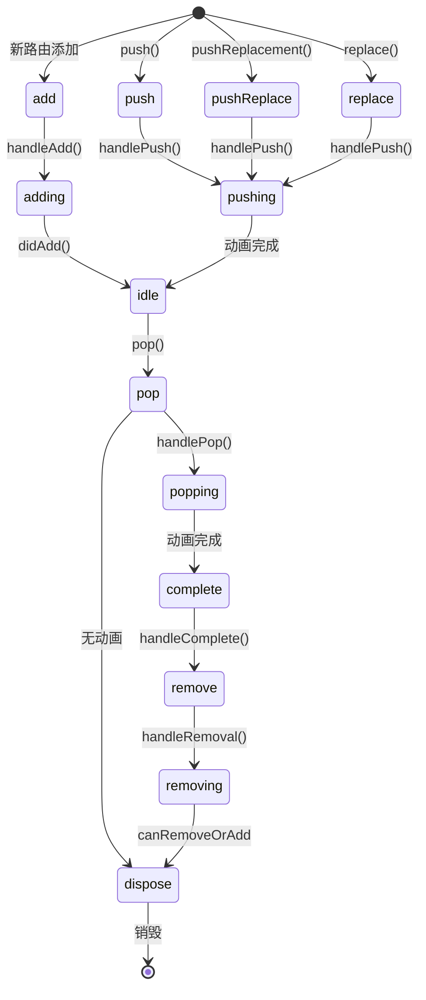

# NavigatorState 历史记录刷新机制

## 概述

`_flushHistoryUpdates()` 是 `NavigatorState` 中负责刷新路由历史记录状态的核心方法。它遍历历史记录，根据每个路由条目的当前生命周期状态，执行相应的状态转换操作，并通知观察者路由变化。

## 方法签名

```dart 4390:4390:packages/flutter/lib/src/widgets/navigator.dart
  void _flushHistoryUpdates({bool rearrangeOverlay = true}) {
```

### 参数说明

- **rearrangeOverlay**：是否重新排列 Overlay 条目，默认为 `true`

## 核心流程

### 1. 初始化和准备

```dart 4391:4406:packages/flutter/lib/src/widgets/navigator.dart
    assert(_debugLocked && !_debugUpdatingPage);
    _flushingHistory = true;
    // Clean up the list, sending updates to the routes that changed. Notably,
    // we don't send the didChangePrevious/didChangeNext updates to those that
    // did not change at this point, because we're not yet sure exactly what the
    // routes will be at the end of the day (some might get disposed).
    int index = _history.length - 1;
    _RouteEntry? next;
    _RouteEntry? entry = _history[index];
    _RouteEntry? previous = index > 0 ? _history[index - 1] : null;
    bool canRemoveOrAdd =
        false; // Whether there is a fully opaque route on top to silently remove or add route underneath.
    Route<dynamic>?
    poppedRoute; // The route that should trigger didPopNext on the top active route.
    bool seenTopActiveRoute = false; // Whether we've seen the route that would get didPopNext.
    final List<_RouteEntry> toBeDisposed = <_RouteEntry>[];
```

**关键变量**：

- **index**：当前处理的路由索引（从后往前）
- **next/entry/previous**：当前路由及其前后路由
- **canRemoveOrAdd**：是否可以静默移除或添加路由
- **poppedRoute**：已弹出的路由，用于触发 `didPopNext`
- **seenTopActiveRoute**：是否已看到顶部活动路由
- **toBeDisposed**：待销毁的路由列表

### 2. 状态机处理循环

方法使用一个大的 `switch` 语句处理各种路由生命周期状态：

```dart 4407:4517:packages/flutter/lib/src/widgets/navigator.dart
    while (index >= 0) {
      switch (entry!.currentState) {
        case _RouteLifecycle.add:
          assert(rearrangeOverlay);
          entry.handleAdd(
            navigator: this,
            previousPresent: _getRouteBefore(index - 1, _RouteEntry.isPresentPredicate)?.route,
          );
          assert(entry.currentState == _RouteLifecycle.adding);
          continue;
        case _RouteLifecycle.adding:
          if (canRemoveOrAdd || next == null) {
            entry.didAdd(navigator: this, isNewFirst: next == null);
            assert(entry.currentState == _RouteLifecycle.idle);
            continue;
          }
        case _RouteLifecycle.push:
        case _RouteLifecycle.pushReplace:
        case _RouteLifecycle.replace:
          assert(rearrangeOverlay);
          entry.handlePush(
            navigator: this,
            previous: previous?.route,
            previousPresent: _getRouteBefore(index - 1, _RouteEntry.isPresentPredicate)?.route,
            isNewFirst: next == null,
          );
          assert(entry.currentState != _RouteLifecycle.push);
          assert(entry.currentState != _RouteLifecycle.pushReplace);
          assert(entry.currentState != _RouteLifecycle.replace);
          if (entry.currentState == _RouteLifecycle.idle) {
            continue;
          }
        case _RouteLifecycle.pushing: // Will exit this state when animation completes.
          if (!seenTopActiveRoute && poppedRoute != null) {
            entry.handleDidPopNext(poppedRoute);
          }
          seenTopActiveRoute = true;
        case _RouteLifecycle.idle:
          if (!seenTopActiveRoute && poppedRoute != null) {
            entry.handleDidPopNext(poppedRoute);
          }
          seenTopActiveRoute = true;
          // This route is idle, so we are allowed to remove subsequent (earlier)
          // routes that are waiting to be removed silently:
          canRemoveOrAdd = true;
        case _RouteLifecycle.pop:
          if (!entry.handlePop(
            navigator: this,
            previousPresent: _getRouteBefore(index, _RouteEntry.willBePresentPredicate)?.route,
          )) {
            assert(entry.currentState == _RouteLifecycle.idle);
            continue;
          }
          if (!seenTopActiveRoute) {
            if (poppedRoute != null) {
              entry.handleDidPopNext(poppedRoute);
            }
            poppedRoute = entry.route;
          }
          _observedRouteDeletions.add(
            _NavigatorPopObservation(
              entry.route,
              _getRouteBefore(index, _RouteEntry.willBePresentPredicate)?.route,
            ),
          );
          if (entry.currentState == _RouteLifecycle.dispose) {
            // The pop finished synchronously. This can happen if transition
            // duration is zero.
            continue;
          }
          assert(entry.currentState == _RouteLifecycle.popping);
          canRemoveOrAdd = true;
        case _RouteLifecycle.popping:
          // Will exit this state when animation completes.
          break;
        case _RouteLifecycle.complete:
          entry.handleComplete();
          assert(entry.currentState == _RouteLifecycle.remove);
          continue;
        case _RouteLifecycle.remove:
          if (!seenTopActiveRoute) {
            if (poppedRoute != null) {
              entry.route.didPopNext(poppedRoute);
            }
            poppedRoute = null;
          }
          entry.handleRemoval(
            navigator: this,
            previousPresent: _getRouteBefore(index, _RouteEntry.willBePresentPredicate)?.route,
          );
          assert(entry.currentState.index >= _RouteLifecycle.removing.index);
          continue;
        case _RouteLifecycle.removing:
          if (!canRemoveOrAdd && next != null) {
            // We aren't allowed to remove this route yet.
            break;
          }
          entry.currentState = _RouteLifecycle.dispose;
          continue;
        case _RouteLifecycle.dispose:
          // Delay disposal until didChangeNext/didChangePrevious have been sent.
          toBeDisposed.add(_history.removeAt(index));
          if (entry.pageBased && entry.imperativeRemoval) {
            widget.onDidRemovePage?.call(entry.route.settings as Page<Object?>);
          }
          entry = next;
        case _RouteLifecycle.disposing:
        case _RouteLifecycle.disposed:
        case _RouteLifecycle.staging:
          assert(false);
      }
      index -= 1;
      next = entry;
      entry = previous;
      previous = index > 0 ? _history[index - 1] : null;
    }
```

### 状态处理详解

#### add 状态

```dart
case _RouteLifecycle.add:
  entry.handleAdd(...);
  // 状态变为 adding
  continue;
```

- **操作**：调用 `handleAdd` 处理路由添加
- **下一状态**：`adding`

#### adding 状态

```dart
case _RouteLifecycle.adding:
  if (canRemoveOrAdd || next == null) {
    entry.didAdd(...);
    // 状态变为 idle
    continue;
  }
```

- **条件**：可以移除/添加或没有下一个路由
- **操作**：调用 `didAdd` 完成添加
- **下一状态**：`idle`

#### push/pushReplace/replace 状态

```dart
case _RouteLifecycle.push:
case _RouteLifecycle.pushReplace:
case _RouteLifecycle.replace:
  entry.handlePush(...);
  // 状态变为 pushing 或 idle
  if (entry.currentState == _RouteLifecycle.idle) {
    continue;
  }
```

- **操作**：调用 `handlePush` 处理路由推送
- **下一状态**：`pushing` 或 `idle`（无动画时）

#### pushing 状态

```dart
case _RouteLifecycle.pushing:
  if (!seenTopActiveRoute && poppedRoute != null) {
    entry.handleDidPopNext(poppedRoute);
  }
  seenTopActiveRoute = true;
  break; // 等待动画完成
```

- **操作**：处理 `didPopNext` 通知
- **行为**：等待动画完成，不继续处理

#### idle 状态

```dart
case _RouteLifecycle.idle:
  if (!seenTopActiveRoute && poppedRoute != null) {
    entry.handleDidPopNext(poppedRoute);
  }
  seenTopActiveRoute = true;
  canRemoveOrAdd = true; // 允许移除后续路由
  break;
```

- **操作**：处理 `didPopNext` 通知
- **效果**：允许静默移除后续路由

#### pop 状态

```dart
case _RouteLifecycle.pop:
  if (!entry.handlePop(...)) {
    // 取消弹出，状态变为 idle
    continue;
  }
  if (!seenTopActiveRoute) {
    poppedRoute = entry.route;
  }
  _observedRouteDeletions.add(...);
  // 状态变为 popping 或 dispose
  canRemoveOrAdd = true;
```

- **操作**：调用 `handlePop` 处理路由弹出
- **效果**：记录弹出观察，允许移除后续路由

#### popping 状态

```dart
case _RouteLifecycle.popping:
  break; // 等待动画完成
```

- **行为**：等待退出动画完成

#### complete 状态

```dart
case _RouteLifecycle.complete:
  entry.handleComplete();
  // 状态变为 remove
  continue;
```

- **操作**：调用 `handleComplete` 完成路由
- **下一状态**：`remove`

#### remove 状态

```dart
case _RouteLifecycle.remove:
  if (!seenTopActiveRoute) {
    entry.route.didPopNext(poppedRoute);
    poppedRoute = null;
  }
  entry.handleRemoval(...);
  // 状态变为 removing
  continue;
```

- **操作**：处理 `didPopNext`，调用 `handleRemoval`
- **下一状态**：`removing`

#### removing 状态

```dart
case _RouteLifecycle.removing:
  if (!canRemoveOrAdd && next != null) {
    break; // 不允许移除
  }
  entry.currentState = _RouteLifecycle.dispose;
  continue;
```

- **条件**：可以移除或没有下一个路由
- **操作**：状态变为 `dispose`

#### dispose 状态

```dart
case _RouteLifecycle.dispose:
  toBeDisposed.add(_history.removeAt(index));
  if (entry.pageBased && entry.imperativeRemoval) {
    widget.onDidRemovePage?.call(...);
  }
  entry = next;
```

- **操作**：从历史记录中移除，添加到待销毁列表
- **回调**：如果是页面路由且是命令式移除，调用 `onDidRemovePage`

### 3. 通知观察者

```dart 4523:4524:packages/flutter/lib/src/widgets/navigator.dart
    // Informs navigator observers about route changes.
    _flushObserverNotifications();
```

调用 `_flushObserverNotifications()` 通知所有观察者路由变化。

### 4. 刷新路由通知

```dart 4526:4528:packages/flutter/lib/src/widgets/navigator.dart
    // Now that the list is clean, send the didChangeNext/didChangePrevious
    // notifications.
    _flushRouteAnnouncement();
```

调用 `_flushRouteAnnouncement()` 发送 `didChangeNext` 和 `didChangePrevious` 通知。

### 5. 更新顶部路由

```dart 4530:4536:packages/flutter/lib/src/widgets/navigator.dart
    final _RouteEntry? lastEntry = _lastRouteEntryWhereOrNull(_RouteEntry.isPresentPredicate);
    if (lastEntry != null && _lastTopmostRoute != lastEntry) {
      for (final NavigatorObserver observer in _effectiveObservers) {
        observer.didChangeTop(lastEntry.route, _lastTopmostRoute?.route);
      }
    }
    _lastTopmostRoute = lastEntry;
```

- **查找顶部路由**：找到当前最顶部的活动路由
- **通知变化**：如果顶部路由发生变化，通知所有观察者
- **更新记录**：更新 `_lastTopmostRoute`

### 6. 报告路由更新

```dart 4537:4544:packages/flutter/lib/src/widgets/navigator.dart
    // Announce route name changes.
    if (widget.reportsRouteUpdateToEngine) {
      final String? routeName = lastEntry?.route.settings.name;
      if (routeName != null && routeName != _lastAnnouncedRouteName) {
        SystemNavigator.routeInformationUpdated(uri: Uri.parse(routeName));
        _lastAnnouncedRouteName = routeName;
      }
    }
```

- **条件**：如果启用了路由更新报告
- **操作**：向系统报告路由名称变化

### 7. 销毁路由

```dart 4546:4550:packages/flutter/lib/src/widgets/navigator.dart
    // Lastly, removes the overlay entries of all marked entries and disposes
    // them.
    for (final _RouteEntry entry in toBeDisposed) {
      _disposeRouteEntry(entry, graceful: true);
    }
```

- **操作**：销毁所有标记为待销毁的路由
- **方式**：优雅销毁（graceful）

### 8. 重新排列 Overlay

```dart 4551:4553:packages/flutter/lib/src/widgets/navigator.dart
    if (rearrangeOverlay) {
      overlay?.rearrange(_allRouteOverlayEntries);
    }
```

- **条件**：如果需要重新排列
- **操作**：重新排列 Overlay 中的所有路由条目

### 9. 更新可序列化历史

```dart 4554:4556:packages/flutter/lib/src/widgets/navigator.dart
    if (bucket != null) {
      _serializableHistory.update(_history);
    }
```

- **条件**：如果有恢复 bucket
- **操作**：更新可序列化的历史记录

### 10. 清理

```dart 4557:4558:packages/flutter/lib/src/widgets/navigator.dart
    _flushingHistory = false;
  }
```

- **操作**：重置刷新标志

## 辅助方法

### _flushObserverNotifications

```dart 4560:4575:packages/flutter/lib/src/widgets/navigator.dart
  void _flushObserverNotifications() {
    if (_effectiveObservers.isEmpty) {
      _observedRouteDeletions.clear();
      _observedRouteAdditions.clear();
      return;
    }
    while (_observedRouteAdditions.isNotEmpty) {
      final _NavigatorObservation observation = _observedRouteAdditions.removeLast();
      _effectiveObservers.forEach(observation.notify);
    }

    while (_observedRouteDeletions.isNotEmpty) {
      final _NavigatorObservation observation = _observedRouteDeletions.removeFirst();
      _effectiveObservers.forEach(observation.notify);
    }
  }
```

**功能**：批量通知观察者路由添加和删除事件。

### _flushRouteAnnouncement

```dart 4577:4606:packages/flutter/lib/src/widgets/navigator.dart
  void _flushRouteAnnouncement() {
    int index = _history.length - 1;
    while (index >= 0) {
      final _RouteEntry entry = _history[index];
      if (!entry.suitableForAnnouncement) {
        index -= 1;
        continue;
      }
      final _RouteEntry? next = _getRouteAfter(
        index + 1,
        _RouteEntry.suitableForTransitionAnimationPredicate,
      );

      if (next?.route != entry.lastAnnouncedNextRoute) {
        if (entry.shouldAnnounceChangeToNext(next?.route)) {
          entry.route.didChangeNext(next?.route);
        }
        entry.lastAnnouncedNextRoute = next?.route;
      }
      final _RouteEntry? previous = _getRouteBefore(
        index - 1,
        _RouteEntry.suitableForTransitionAnimationPredicate,
      );
      if (previous?.route != entry.lastAnnouncedPreviousRoute) {
        entry.route.didChangePrevious(previous?.route);
        entry.lastAnnouncedPreviousRoute = previous?.route;
      }
      index -= 1;
    }
  }
```

**功能**：通知路由其前后路由的变化。

## 状态转换图



## 关键设计要点

### 1. 从后往前处理

- **原因**：顶部路由的变化会影响底部路由的通知
- **效果**：确保 `didPopNext` 等通知的正确顺序

### 2. 延迟销毁

- **原因**：需要先发送 `didChangeNext/didChangePrevious` 通知
- **方式**：先添加到 `toBeDisposed`，最后统一销毁

### 3. 状态机设计

- **优点**：清晰的状态转换，易于理解和维护
- **特点**：每个状态都有明确的处理逻辑

### 4. 观察者通知

- **批量处理**：使用队列收集通知，最后批量发送
- **顺序保证**：先处理添加，再处理删除

## 注意事项

1. **必须锁定**：调用前必须设置 `_debugLocked = true`
2. **不能更新页面**：调用时不能正在更新页面（`_debugUpdatingPage = false`）
3. **状态一致性**：确保路由状态在整个过程中保持一致
4. **动画完成**：某些状态需要等待动画完成才能继续

## 相关文档

- [NavigatorState 历史记录更新机制](navigator.dart_NavigatorState_3_历史记录更新机制.md)
- [NavigatorState 生命周期管理](navigator.dart_NavigatorState_2_生命周期管理.md)
- [Navigator 概述与使用指南](navigator.dart_Navigator_1_概述与使用指南.md)
