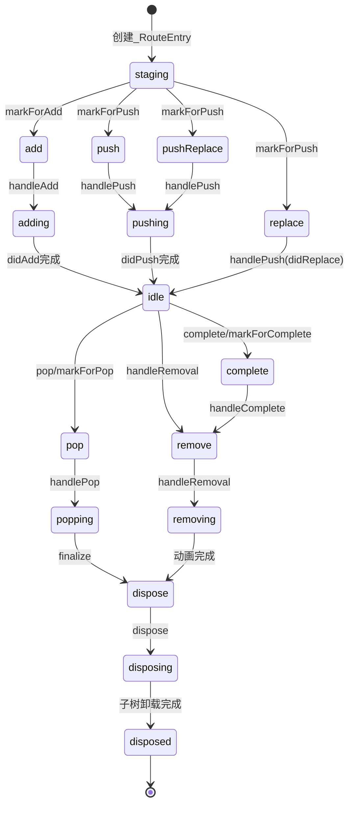

# _RouteEntry 类详解

## 概述

`_RouteEntry` 是 Flutter Navigator 系统中的核心内部类，用于管理路由的生命周期状态和转换过程。该类实现了 `RouteTransitionRecord` 接口，是 `NavigatorState` 内部用于跟踪和管理单个路由状态的关键数据结构。

### 类定义

```dart 3128:3144:packages/flutter/lib/src/widgets/navigator.dart
class _RouteEntry extends RouteTransitionRecord {
  _RouteEntry(
    this.route, {
    required _RouteLifecycle initialState,
    required this.pageBased,
    this.restorationInformation,
  }) : assert(!pageBased || route.settings is Page),
       assert(
         initialState == _RouteLifecycle.staging ||
             initialState == _RouteLifecycle.add ||
             initialState == _RouteLifecycle.push ||
             initialState == _RouteLifecycle.pushReplace ||
             initialState == _RouteLifecycle.replace,
       ),
       currentState = initialState {
    assert(debugMaybeDispatchCreated('widgets', '_RouteEntry', this));
  }
```

### 继承关系

- **继承自**：`RouteTransitionRecord` - 路由转换记录抽象类，定义了路由状态转换的基本接口

### 主要职责

1. **生命周期管理**：跟踪路由从创建到销毁的完整生命周期状态
2. **状态转换控制**：实现路由在不同状态之间的转换逻辑
3. **路由操作处理**：处理路由的添加、推入、弹出、替换等操作
4. **状态恢复支持**：管理路由的状态恢复信息，支持应用重启后恢复导航状态
5. **观察者通知**：管理路由变化事件的通知机制

### 在 Navigator 系统中的作用

`_RouteEntry` 是 `NavigatorState` 内部使用的私有类（以下划线开头），用于包装 `Route` 对象并跟踪其状态。每个 `Route` 在导航器中被一个 `_RouteEntry` 实例包装，存储在 `_History` 中，形成一个路由历史记录栈。

## 构造函数与初始化

### 构造函数参数

```dart 3129:3144:packages/flutter/lib/src/widgets/navigator.dart
  _RouteEntry(
    this.route, {
    required _RouteLifecycle initialState,
    required this.pageBased,
    this.restorationInformation,
  }) : assert(!pageBased || route.settings is Page),
       assert(
         initialState == _RouteLifecycle.staging ||
             initialState == _RouteLifecycle.add ||
             initialState == _RouteLifecycle.push ||
             initialState == _RouteLifecycle.pushReplace ||
             initialState == _RouteLifecycle.replace,
       ),
       currentState = initialState {
    assert(debugMaybeDispatchCreated('widgets', '_RouteEntry', this));
  }
```

### 参数说明

1. **`route`**（必需）：
   - **类型**：`Route<dynamic>`
   - **说明**：被包装的路由对象，这是 `_RouteEntry` 管理的核心对象

2. **`initialState`**（必需）：
   - **类型**：`_RouteLifecycle`
   - **说明**：路由的初始生命周期状态
   - **允许的值**：
     - `_RouteLifecycle.staging`：暂存状态，等待转换代理决定如何处理
     - `_RouteLifecycle.add`：添加状态，用于初始路由或通过 Pages API 创建的路由
     - `_RouteLifecycle.push`：推入状态，通过 `Navigator.push` 等方法添加的路由
     - `_RouteLifecycle.pushReplace`：推入替换状态，通过 `Navigator.pushReplacement` 添加的路由
     - `_RouteLifecycle.replace`：替换状态，通过 `Navigator.replace` 添加的路由

3. **`pageBased`**（必需）：
   - **类型**：`bool`
   - **说明**：标识路由是否基于 `Page` 对象创建
   - **用途**：基于 `Page` 的路由可以使用 `Navigator.pages` API 进行管理，支持声明式路由更新

4. **`restorationInformation`**（可选）：
   - **类型**：`_RestorationInformation?`
   - **说明**：状态恢复信息，用于应用重启后恢复路由状态
   - **用途**：支持路由的状态持久化和恢复机制

### 初始化验证

构造函数包含两个关键的断言验证：

1. **`pageBased` 验证**：

   ```dart
   assert(!pageBased || route.settings is Page)
   ```

   - 如果 `pageBased` 为 `true`，则 `route.settings` 必须是 `Page` 类型
   - 确保基于 `Page` 的路由具有正确的设置类型

2. **初始状态验证**：

   ```dart
   assert(
     initialState == _RouteLifecycle.staging ||
         initialState == _RouteLifecycle.add ||
         initialState == _RouteLifecycle.push ||
         initialState == _RouteLifecycle.pushReplace ||
         initialState == _RouteLifecycle.replace,
   )
   ```

   - 确保初始状态必须是有效的进入状态之一
   - 不允许使用退出状态（如 `pop`、`complete`、`remove` 等）作为初始状态

### 初始化过程

1. **状态设置**：将 `currentState` 设置为 `initialState`
2. **调试跟踪**：调用 `debugMaybeDispatchCreated` 进行调试跟踪（仅在调试模式下有效）

## 核心属性

### 1. 路由对象

```dart 3146:3147:packages/flutter/lib/src/widgets/navigator.dart
  @override
  final Route<dynamic> route;
```

- **类型**：`Route<dynamic>`
- **说明**：被包装的路由对象，这是 `_RouteEntry` 管理的核心数据
- **特点**：只读属性，通过构造函数传入

### 2. 状态恢复信息

```dart 3148:3148:packages/flutter/lib/src/widgets/navigator.dart
  final _RestorationInformation? restorationInformation;
```

- **类型**：`_RestorationInformation?`
- **说明**：路由的状态恢复信息，用于应用重启后恢复路由状态
- **用途**：支持状态持久化和恢复机制

### 3. 基于 Page 标志

```dart 3149:3149:packages/flutter/lib/src/widgets/navigator.dart
  final bool pageBased;
```

- **类型**：`bool`
- **说明**：标识路由是否基于 `Page` 对象创建
- **用途**：基于 `Page` 的路由可以使用声明式 API 进行管理

### 4. 当前生命周期状态

```dart 3157:3157:packages/flutter/lib/src/widgets/navigator.dart
  _RouteLifecycle currentState;
```

- **类型**：`_RouteLifecycle`
- **说明**：路由当前的生命周期状态，这是状态机的核心
- **可变性**：可变属性，在路由生命周期中不断变化

### 5. 待返回结果

```dart 3350:3350:packages/flutter/lib/src/widgets/navigator.dart
  Object? pendingResult;
```

- **类型**：`Object?`
- **说明**：路由弹出或完成时待返回的结果值
- **用途**：用于在路由关闭时传递数据给调用者

### 6. 命令式移除标志

```dart 3166:3168:packages/flutter/lib/src/widgets/navigator.dart
  // Whether this route is removed without using a Navigator.pages api.
  // For example, Navigator.pop or Navigator.pushReplacement.
  bool imperativeRemoval = false;
```

- **类型**：`bool`
- **说明**：标识路由是否通过命令式 API（如 `Navigator.pop`、`Navigator.pushReplacement`）移除
- **用途**：区分命令式移除和声明式移除（通过 `Navigator.pages` API）

### 7. 路由通知状态

```dart 3158:3164:packages/flutter/lib/src/widgets/navigator.dart
  _RoutePlaceholder? lastAnnouncedPreviousRoute =
      notAnnounced; // last argument to Route.didChangePrevious
  WeakReference<_RoutePlaceholder> lastAnnouncedPoppedNextRoute = WeakReference<_RoutePlaceholder>(
    notAnnounced,
  ); // last argument to Route.didPopNext
  _RoutePlaceholder? lastAnnouncedNextRoute = notAnnounced; // last argument to Route.didChangeNext
```

这些属性用于跟踪路由之间的变化通知状态：

- **`lastAnnouncedPreviousRoute`**：上次通知的前一个路由
- **`lastAnnouncedPoppedNextRoute`**：上次弹出通知的下一个路由（使用弱引用）
- **`lastAnnouncedNextRoute`**：上次通知的下一个路由

**用途**：避免重复通知相同的路由变化，优化性能。

### 8. 焦点节点

```dart 3164:3164:packages/flutter/lib/src/widgets/navigator.dart
  int? lastFocusNode; // The last focused semantic node for the route entry.
```

- **类型**：`int?`
- **说明**：路由条目中最后聚焦的语义节点 ID
- **用途**：在路由弹出后恢复焦点位置，提升可访问性

### 9. 移除观察者报告标志

```dart 3359:3359:packages/flutter/lib/src/widgets/navigator.dart
  bool _reportRemovalToObserver = true;
```

- **类型**：`bool`
- **说明**：控制是否向观察者报告路由移除事件
- **用途**：在路由被替换时，避免重复报告移除事件

### 10. 状态恢复 ID（计算属性）

```dart 3170:3183:packages/flutter/lib/src/widgets/navigator.dart
  /// Restoration ID to be used for the encapsulating route when restoration is
  /// enabled for it or null if restoration cannot be enabled for it.
  String? get restorationId {
    // User-provided restoration ids of Pages are prefixed with 'p+'. Generated
    // ids for pageless routes are prefixed with 'r+' to avoid clashes.
    if (pageBased) {
      final Page<Object?> page = route.settings as Page<Object?>;
      return page.restorationId != null ? 'p+${page.restorationId}' : null;
    }
    if (restorationInformation != null) {
      return 'r+${restorationInformation!.restorationScopeId}';
    }
    return null;
  }
```

- **类型**：`String?`
- **说明**：路由的状态恢复 ID，用于状态持久化
- **规则**：
  - 基于 `Page` 的路由：使用 `'p+'` 前缀 + `Page.restorationId`
  - 非基于 `Page` 的路由：使用 `'r+'` 前缀 + `restorationInformation.restorationScopeId`
  - 如果都没有，返回 `null`

### 静态常量

```dart 3151:3155:packages/flutter/lib/src/widgets/navigator.dart
  /// The limit this route entry will attempt to pop in the case of route being
  /// remove as a result of a page update.
  static const int kDebugPopAttemptLimit = 100;

  static const _RoutePlaceholder notAnnounced = _RoutePlaceholder();
```

- **`kDebugPopAttemptLimit`**：调试模式下弹出尝试的最大次数限制（100 次）
- **`notAnnounced`**：未通知状态的占位符常量

## 生命周期状态管理

`_RouteEntry` 使用 `_RouteLifecycle` 枚举来管理路由的完整生命周期。这是一个状态机，路由只能从初始状态向终止状态单向转换（只向下转换）。

### _RouteLifecycle 枚举定义

```dart 3090:3119:packages/flutter/lib/src/widgets/navigator.dart
enum _RouteLifecycle {
  staging, // we will wait for transition delegate to decide what to do with this route.
  //
  // routes that are present:
  //
  add, // we'll want to run install, didAdd, etc; a route created by onGenerateInitialRoutes or by the initial widget.pages
  adding, // we'll waiting for the future from didPush of top-most route to complete
  // routes that are ready for transition.
  push, // we'll want to run install, didPush, etc; a route added via push() and friends
  pushReplace, // we'll want to run install, didPush, etc; a route added via pushReplace() and friends
  pushing, // we're waiting for the future from didPush to complete
  replace, // we'll want to run install, didReplace, etc; a route added via replace() and friends
  idle, // route is being harmless
  //
  // routes that are not present:
  //
  // routes that should be included in route announcement and should still listen to transition changes.
  pop, // we'll want to call didPop
  complete, // we'll want to call didComplete,
  remove, // we'll want to run didReplace/didRemove etc
  // routes should not be included in route announcement but should still listen to transition changes.
  popping, // we're waiting for the route to call finalizeRoute to switch to dispose
  removing, // we are waiting for subsequent routes to be done animating, then will switch to dispose
  // routes that are completely removed from the navigator and overlay.
  dispose, // we will dispose the route momentarily
  disposing, // The entry is waiting for its widget subtree to be disposed
  // first. It is stored in _entryWaitingForSubTreeDisposal while
  // awaiting that.
  disposed, // we have disposed the route
}
```

### 状态机流程图



### 状态分类说明

#### 进入状态（Entering States）

路由添加到导航器时的初始状态：

1. **`staging`**：暂存状态，等待 `TransitionDelegate` 决定如何处理路由
2. **`add`**：标记为添加状态（无动画），用于初始路由或通过 Pages API 创建的路由
3. **`push`**：标记为推入状态（有动画），通过 `Navigator.push` 等方法添加
4. **`pushReplace`**：标记为推入替换状态（有动画），通过 `Navigator.pushReplacement` 添加
5. **`replace`**：标记为替换状态，通过 `Navigator.replace` 添加

#### 过渡状态（Transitioning States）

路由正在执行过渡动画时的状态：

1. **`adding`**：正在添加中，等待顶层路由的 `didPush` 完成
2. **`pushing`**：正在推入中，等待 `didPush` 返回的 `TickerFuture` 完成

#### 活动状态（Active State）

1. **`idle`**：路由处于空闲状态，已经显示在屏幕上，这是路由的正常活动状态

#### 退出状态（Exiting States）

路由准备退出时的状态：

1. **`pop`**：标记为弹出状态（有动画），准备调用 `didPop`
2. **`complete`**：标记为完成状态（无动画），准备调用 `didComplete`
3. **`remove`**：标记为移除状态，准备调用 `didReplace` 或 `didRemove`

#### 退出过渡状态（Exiting Transition States）

路由正在执行退出动画时的状态：

1. **`popping`**：正在弹出中，等待路由调用 `finalizeRoute` 切换到 `dispose`
2. **`removing`**：正在移除中，等待后续路由完成动画后切换到 `dispose`

#### 销毁状态（Disposal States）

路由正在被销毁时的状态：

1. **`dispose`**：准备销毁路由，即将调用 `dispose` 方法
2. **`disposing`**：正在销毁中，等待路由的 widget 子树卸载完成
3. **`disposed`**：已销毁，路由已完全清理，这是终止状态

### 状态转换规则

1. **单向转换**：状态只能从早期状态向后期状态转换，不能反向
2. **瞬时状态**：`add`、`push`、`pushReplace`、`replace`、`pop`、`complete`、`remove`、`dispose` 是瞬时状态，在 `_flushHistoryUpdates` 运行时会被处理并转换
3. **异步状态**：`adding`、`pushing`、`popping`、`removing`、`disposing` 是异步状态，等待特定事件（如动画完成、子树卸载）后自动转换

### 状态查询方法

```dart 3451:3471:packages/flutter/lib/src/widgets/navigator.dart
  bool get willBePresent {
    return currentState.index <= _RouteLifecycle.idle.index &&
        currentState.index >= _RouteLifecycle.add.index;
  }

  bool get isPresent {
    return currentState.index <= _RouteLifecycle.remove.index &&
        currentState.index >= _RouteLifecycle.add.index;
  }

  bool get isPresentForRestoration => currentState.index <= _RouteLifecycle.idle.index;

  bool get suitableForAnnouncement {
    return currentState.index <= _RouteLifecycle.removing.index &&
        currentState.index >= _RouteLifecycle.push.index;
  }

  bool get suitableForTransitionAnimation {
    return currentState.index <= _RouteLifecycle.remove.index &&
        currentState.index >= _RouteLifecycle.push.index;
  }
```

这些方法基于状态的索引值来判断路由的当前状态特征：

1. **`willBePresent`**：路由将来会显示（状态在 `add` 到 `idle` 之间）
2. **`isPresent`**：路由当前正在显示（状态在 `add` 到 `remove` 之间）
3. **`isPresentForRestoration`**：路由状态适合恢复（状态在初始状态到 `idle` 之间）
4. **`suitableForAnnouncement`**：路由适合进行可访问性公告（状态在 `push` 到 `removing` 之间）
5. **`suitableForTransitionAnimation`**：路由适合进行转场动画（状态在 `push` 到 `remove` 之间）

## 路由处理方法

`_RouteEntry` 提供了多个处理方法，用于处理路由的各种操作。这些方法由 `NavigatorState` 在适当的时候调用。

### 1. handleAdd - 处理路由添加

```dart 3196:3201:packages/flutter/lib/src/widgets/navigator.dart
  void handleAdd({required NavigatorState navigator, required Route<dynamic>? previousPresent}) {
    assert(currentState == _RouteLifecycle.add);
    assert(navigator._debugLocked);
    currentState = _RouteLifecycle.adding;
    navigator._observedRouteAdditions.add(_NavigatorPushObservation(route, previousPresent));
  }
```

- **功能**：处理路由的添加操作（无动画）
- **前提条件**：当前状态必须是 `_RouteLifecycle.add`
- **状态转换**：`add` → `adding`
- **操作**：将路由添加观察事件加入队列，通知观察者

### 2. handlePush - 处理路由推入

```dart 3203:3257:packages/flutter/lib/src/widgets/navigator.dart
  void handlePush({
    required NavigatorState navigator,
    required bool isNewFirst,
    required Route<dynamic>? previous,
    required Route<dynamic>? previousPresent,
  }) {
    assert(
      currentState == _RouteLifecycle.push ||
          currentState == _RouteLifecycle.pushReplace ||
          currentState == _RouteLifecycle.replace,
    );
    assert(navigator._debugLocked);
    assert(
      route._navigator == null,
      'The pushed route has already been used. When pushing a route, a new '
      'Route object must be provided.',
    );
    final _RouteLifecycle previousState = currentState;
    route._navigator = navigator;
    route.install();
    assert(route.overlayEntries.isNotEmpty);
    if (currentState == _RouteLifecycle.push || currentState == _RouteLifecycle.pushReplace) {
      final TickerFuture routeFuture = route.didPush();
      currentState = _RouteLifecycle.pushing;
      routeFuture.whenCompleteOrCancel(() {
        if (currentState == _RouteLifecycle.pushing) {
          currentState = _RouteLifecycle.idle;
          assert(!navigator._debugLocked);
          assert(() {
            navigator._debugLocked = true;
            return true;
          }());
          navigator._flushHistoryUpdates();
          assert(() {
            navigator._debugLocked = false;
            return true;
          }());
        }
      });
    } else {
      assert(currentState == _RouteLifecycle.replace);
      route.didReplace(previous);
      currentState = _RouteLifecycle.idle;
    }
    if (isNewFirst) {
      route.didChangeNext(null);
    }

    if (previousState == _RouteLifecycle.replace || previousState == _RouteLifecycle.pushReplace) {
      navigator._observedRouteAdditions.add(_NavigatorReplaceObservation(route, previousPresent));
    } else {
      assert(previousState == _RouteLifecycle.push);
      navigator._observedRouteAdditions.add(_NavigatorPushObservation(route, previousPresent));
    }
  }
```

- **功能**：处理路由的推入、推入替换或替换操作
- **前提条件**：当前状态必须是 `push`、`pushReplace` 或 `replace` 之一
- **参数说明**：
  - `navigator`：导航器状态对象
  - `isNewFirst`：是否为新的第一个路由
  - `previous`：前一个路由（用于替换操作）
  - `previousPresent`：前一个当前存在的路由
- **状态转换**：
  - `push`/`pushReplace` → `pushing` → `idle`（异步完成）
  - `replace` → `idle`（同步完成）
- **关键操作**：
  1. 设置路由的导航器引用
  2. 调用 `route.install()` 安装路由
  3. 对于 `push`/`pushReplace`：调用 `route.didPush()` 并等待动画完成
  4. 对于 `replace`：调用 `route.didReplace(previous)`
  5. 如果是新的第一个路由，调用 `route.didChangeNext(null)`
  6. 添加观察者通知事件

### 3. handlePop - 处理路由弹出

```dart 3286:3311:packages/flutter/lib/src/widgets/navigator.dart
  /// Process the to-be-popped route.
  ///
  /// A route can be marked for pop by transition delegate or Navigator.pop,
  /// this method actually pops the route by calling Route.didPop.
  ///
  /// Returns true if the route is popped; otherwise, returns false if the route
  /// refuses to be popped.
  bool handlePop({required NavigatorState navigator, required Route<dynamic>? previousPresent}) {
    assert(navigator._debugLocked);
    assert(route._navigator == navigator);
    currentState = _RouteLifecycle.popping;
    if (route._popCompleter.isCompleted) {
      // This is a page-based route popped through the Navigator.pop. The
      // didPop should have been called. No further action is needed.
      assert(pageBased);
      assert(pendingResult == null);
      return true;
    }
    if (!route.didPop(pendingResult)) {
      currentState = _RouteLifecycle.idle;
      return false;
    }
    route.onPopInvokedWithResult(true, pendingResult);
    pendingResult = null;
    return true;
  }
```

- **功能**：处理路由的弹出操作
- **返回值**：`true` 表示路由已弹出，`false` 表示路由拒绝弹出
- **前提条件**：当前状态必须是 `_RouteLifecycle.pop`
- **状态转换**：`pop` → `popping`（如果弹出成功）
- **处理逻辑**：
  1. 如果 `_popCompleter` 已完成，说明是通过 `Navigator.pop` 弹出的页面路由，直接返回 `true`
  2. 调用 `route.didPop(pendingResult)` 尝试弹出路由
  3. 如果路由拒绝弹出（返回 `false`），状态恢复为 `idle`，返回 `false`
  4. 如果弹出成功，调用 `route.onPopInvokedWithResult` 并清空 `pendingResult`，返回 `true`

### 4. handleComplete - 处理路由完成

```dart 3313:3318:packages/flutter/lib/src/widgets/navigator.dart
  void handleComplete() {
    route.didComplete(pendingResult);
    pendingResult = null;
    assert(route._popCompleter.isCompleted); // implies didComplete was called
    currentState = _RouteLifecycle.remove;
  }
```

- **功能**：处理路由的完成操作（无动画移除）
- **前提条件**：当前状态必须是 `_RouteLifecycle.complete`
- **状态转换**：`complete` → `remove`
- **操作**：
  1. 调用 `route.didComplete(pendingResult)` 完成路由
  2. 清空 `pendingResult`
  3. 状态转换为 `remove`

### 5. handleRemoval - 处理路由移除

```dart 3320:3336:packages/flutter/lib/src/widgets/navigator.dart
  void handleRemoval({
    required NavigatorState navigator,
    required Route<dynamic>? previousPresent,
  }) {
    assert(navigator._debugLocked);
    if (route._navigator == navigator) {
      currentState = _RouteLifecycle.removing;
    } else {
      // This route is still waiting to be added while a top-most push or pop
      // animation is still on-going. In this case, this route can be disposed
      // directly since nothing has been initialized yet.
      currentState = _RouteLifecycle.dispose;
    }
    if (_reportRemovalToObserver) {
      navigator._observedRouteDeletions.add(_NavigatorRemoveObservation(route, previousPresent));
    }
  }
```

- **功能**：处理路由的移除操作
- **前提条件**：路由必须处于可移除状态
- **状态转换**：
  - 如果路由已安装：`remove` → `removing`
  - 如果路由尚未安装：直接转换为 `dispose`
- **操作**：
  1. 根据路由是否已安装决定状态转换路径
  2. 如果需要报告观察者，添加移除观察事件

### 6. handleDidPopNext - 处理下一个路由弹出后的回调

```dart 3259:3284:packages/flutter/lib/src/widgets/navigator.dart
  void handleDidPopNext(Route<dynamic> poppedRoute) {
    route.didPopNext(poppedRoute);
    lastAnnouncedPoppedNextRoute = WeakReference<Route<dynamic>>(poppedRoute);
    if (lastFocusNode != null) {
      // Move focus back to the last focused node.
      poppedRoute._disposeCompleter.future.then((dynamic result) async {
        switch (defaultTargetPlatform) {
          case TargetPlatform.android:
            // In the Android platform, we have to wait for the system refocus to complete before
            // sending the refocus message. Otherwise, the refocus message will be ignored.
            // TODO(hangyujin): update this logic if Android provide a better way to do so.
            final int? reFocusNode = lastFocusNode;
            await Future<void>.delayed(_kAndroidRefocusingDelayDuration);
            SystemChannels.accessibility.send(
              const FocusSemanticEvent().toMap(nodeId: reFocusNode),
            );
          case TargetPlatform.iOS:
            SystemChannels.accessibility.send(
              const FocusSemanticEvent().toMap(nodeId: lastFocusNode),
            );
          case _:
            break;
        }
      });
    }
  }
```

- **功能**：处理下一个路由弹出后的回调，用于通知当前路由下一个路由已弹出
- **操作**：
  1. 调用 `route.didPopNext(poppedRoute)` 通知路由
  2. 更新 `lastAnnouncedPoppedNextRoute` 记录
  3. 如果有焦点节点记录，在弹出路由销毁后恢复焦点（针对 Android 和 iOS 平台）

### 7. didAdd - 路由已添加处理

```dart 3338:3348:packages/flutter/lib/src/widgets/navigator.dart
  void didAdd({required NavigatorState navigator, required bool isNewFirst}) {
    assert(route._navigator == null);
    route._navigator = navigator;
    route.install();
    assert(route.overlayEntries.isNotEmpty);
    route.didAdd();
    currentState = _RouteLifecycle.idle;
    if (isNewFirst) {
      route.didChangeNext(null);
    }
  }
```

- **功能**：完成路由的添加操作（无动画）
- **前提条件**：当前状态必须是 `_RouteLifecycle.adding`，且路由尚未关联导航器
- **状态转换**：`adding` → `idle`
- **操作**：
  1. 设置路由的导航器引用
  2. 调用 `route.install()` 安装路由
  3. 调用 `route.didAdd()` 通知路由已添加
  4. 如果是新的第一个路由，调用 `route.didChangeNext(null)`
  5. 状态转换为 `idle`

## 状态转换标记方法

这些方法实现了 `RouteTransitionRecord` 接口，用于在 `TransitionDelegate.resolve` 过程中标记路由的状态转换方向。这些方法通常在路由处于 `staging` 状态或等待退出决策时调用。

### 1. markForPush - 标记为推入状态

```dart 3498:3506:packages/flutter/lib/src/widgets/navigator.dart
  @override
  void markForPush() {
    assert(
      isWaitingForEnteringDecision && !isWaitingForExitingDecision,
      'This route cannot be marked for push. Either a decision has already been '
      'made or it does not require an explicit decision on how to transition in.',
    );
    currentState = _RouteLifecycle.push;
  }
```

- **功能**：将路由标记为推入状态（有动画过渡）
- **前提条件**：
  - `isWaitingForEnteringDecision` 必须为 `true`（路由等待进入决策）
  - `isWaitingForExitingDecision` 必须为 `false`（路由不在等待退出决策）
- **状态转换**：`staging` → `push`
- **用途**：在 `TransitionDelegate.resolve` 中调用，表示路由应该通过动画推入屏幕

### 2. markForAdd - 标记为添加状态

```dart 3508:3516:packages/flutter/lib/src/widgets/navigator.dart
  @override
  void markForAdd() {
    assert(
      isWaitingForEnteringDecision && !isWaitingForExitingDecision,
      'This route cannot be marked for add. Either a decision has already been '
      'made or it does not require an explicit decision on how to transition in.',
    );
    currentState = _RouteLifecycle.add;
  }
```

- **功能**：将路由标记为添加状态（无动画过渡）
- **前提条件**：
  - `isWaitingForEnteringDecision` 必须为 `true`
  - `isWaitingForExitingDecision` 必须为 `false`
- **状态转换**：`staging` → `add`
- **用途**：在 `TransitionDelegate.resolve` 中调用，表示路由应该直接添加到屏幕，不进行动画过渡

### 3. markForPop - 标记为弹出状态

```dart 3518:3537:packages/flutter/lib/src/widgets/navigator.dart
  @override
  void markForPop([dynamic result]) {
    assert(
      !isWaitingForEnteringDecision && isWaitingForExitingDecision && isPresent,
      'This route cannot be marked for pop. Either a decision has already been '
      'made or it does not require an explicit decision on how to transition out.',
    );
    // Remove state that prevents a pop, e.g. LocalHistoryEntry[s].
    int attempt = 0;
    while (route.willHandlePopInternally) {
      assert(() {
        attempt += 1;
        return attempt < kDebugPopAttemptLimit;
      }(), 'Attempted to pop $route $kDebugPopAttemptLimit times, but still failed');
      final bool popResult = route.didPop(result);
      assert(!popResult);
    }
    pop<dynamic>(result, imperativeRemoval: false);
    _isWaitingForExitingDecision = false;
  }
```

- **功能**：将路由标记为弹出状态（有动画过渡）
- **参数**：`result`（可选）- 路由弹出时返回的结果值
- **前提条件**：
  - `isWaitingForEnteringDecision` 必须为 `false`
  - `isWaitingForExitingDecision` 必须为 `true`
  - `isPresent` 必须为 `true`（路由当前正在显示）
- **状态转换**：`idle` → `pop`
- **处理逻辑**：
  1. 如果路由内部处理弹出（如 `LocalHistoryEntry`），循环调用 `route.didPop` 直到路由不再内部处理
  2. 调用 `pop` 方法设置 `pendingResult` 并将状态转换为 `pop`
  3. 清除 `_isWaitingForExitingDecision` 标志
- **用途**：在 `TransitionDelegate.resolve` 中调用，表示路由应该通过动画弹出屏幕

### 4. markForComplete - 标记为完成状态

```dart 3539:3549:packages/flutter/lib/src/widgets/navigator.dart
  @override
  void markForComplete([dynamic result]) {
    assert(
      !isWaitingForEnteringDecision && isWaitingForExitingDecision && isPresent,
      'This route cannot be marked for complete. Either a decision has already '
      'been made or it does not require an explicit decision on how to transition '
      'out.',
    );
    complete<dynamic>(result, isReplaced: false, imperativeRemoval: false);
    _isWaitingForExitingDecision = false;
  }
```

- **功能**：将路由标记为完成状态（无动画过渡移除）
- **参数**：`result`（可选）- 路由完成时返回的结果值
- **前提条件**：
  - `isWaitingForEnteringDecision` 必须为 `false`
  - `isWaitingForExitingDecision` 必须为 `true`
  - `isPresent` 必须为 `true`
- **状态转换**：`idle` → `complete`
- **操作**：
  1. 调用 `complete` 方法设置 `pendingResult` 并将状态转换为 `complete`
  2. 清除 `_isWaitingForExitingDecision` 标志
- **用途**：在 `TransitionDelegate.resolve` 中调用，表示路由应该直接完成并移除，不进行动画过渡

### 内部状态转换方法

这些方法由 `markFor*` 方法内部调用，用于实际执行状态转换：

#### pop - 设置弹出状态

```dart 3352:3357:packages/flutter/lib/src/widgets/navigator.dart
  void pop<T>(T? result, {required bool imperativeRemoval}) {
    assert(isPresent);
    pendingResult = result;
    currentState = _RouteLifecycle.pop;
    this.imperativeRemoval = imperativeRemoval;
  }
```

- **功能**：设置路由的弹出状态和结果
- **参数**：
  - `result`：弹出时返回的结果值
  - `imperativeRemoval`：是否为命令式移除

#### complete - 设置完成状态

```dart 3361:3371:packages/flutter/lib/src/widgets/navigator.dart
  // Route completes with `result` and is removed.
  void complete<T>(T result, {required bool isReplaced, required bool imperativeRemoval}) {
    if (currentState.index >= _RouteLifecycle.remove.index) {
      return;
    }
    assert(isPresent);
    _reportRemovalToObserver = !isReplaced;
    pendingResult = result;
    currentState = _RouteLifecycle.complete;
    this.imperativeRemoval = imperativeRemoval;
  }
```

- **功能**：设置路由的完成状态和结果
- **参数**：
  - `result`：完成时返回的结果值
  - `isReplaced`：路由是否被替换
  - `imperativeRemoval`：是否为命令式移除
- **防护**：如果状态已经是 `remove` 或之后的状态，直接返回（避免重复处理）

## 路由销毁处理

路由销毁是路由生命周期的最后一个阶段。`_RouteEntry` 提供了多个方法来处理路由的最终化和销毁。

### 1. finalize - 路由最终化

```dart 3373:3376:packages/flutter/lib/src/widgets/navigator.dart
  void finalize() {
    assert(currentState.index < _RouteLifecycle.dispose.index);
    currentState = _RouteLifecycle.dispose;
  }
```

- **功能**：将路由最终化为 `dispose` 状态，准备销毁
- **前提条件**：当前状态必须早于 `dispose` 状态
- **状态转换**：任何早于 `dispose` 的状态 → `dispose`
- **用途**：在路由动画完成后调用，标记路由准备销毁

### 2. dispose - 销毁路由（等待子树卸载）

```dart 3389:3449:packages/flutter/lib/src/widgets/navigator.dart
  /// Disposes this route entry and its [route].
  ///
  /// This method waits for the widget subtree of the [route] to unmount before
  /// disposing. If subtree is already unmounted, this method calls
  /// [forcedDispose] immediately.
  ///
  /// Use [forcedDispose] if the [route] need to be disposed immediately.
  void dispose() {
    assert(currentState.index < _RouteLifecycle.disposing.index);
    currentState = _RouteLifecycle.disposing;

    // If the overlay entries are still mounted, widgets in the route's subtree
    // may still reference resources from the route and we delay disposal of
    // the route until the overlay entries are no longer mounted.
    // Since the overlay entry is the root of the route's subtree it will only
    // get unmounted after every other widget in the subtree has been unmounted.

    final Iterable<OverlayEntry> mountedEntries = route.overlayEntries.where(
      (OverlayEntry e) => e.mounted,
    );

    if (mountedEntries.isEmpty) {
      forcedDispose();
      return;
    }

    int mounted = mountedEntries.length;
    assert(mounted > 0);
    final NavigatorState navigator = route._navigator!;
    navigator._entryWaitingForSubTreeDisposal.add(this);
    for (final OverlayEntry entry in mountedEntries) {
      late VoidCallback listener;
      listener = () {
        assert(mounted > 0);
        assert(!entry.mounted);
        mounted--;
        entry.removeListener(listener);
        if (mounted == 0) {
          assert(route.overlayEntries.every((OverlayEntry e) => !e.mounted));
          // This is a listener callback of one of the overlayEntries in this
          // route. Disposing the route also disposes its overlayEntries and
          // violates the rule that a change notifier can't be disposed during
          // its notifying callback.
          //
          // Use a microtask to ensure the overlayEntries have finished
          // notifying their listeners before disposing.
          return scheduleMicrotask(() {
            if (!navigator._entryWaitingForSubTreeDisposal.remove(this)) {
              // This route must have been destroyed as a result of navigator
              // force dispose.
              assert(route._navigator == null && !navigator.mounted);
              return;
            }
            assert(currentState == _RouteLifecycle.disposing);
            forcedDispose();
          });
        }
      };
      entry.addListener(listener);
    }
  }
```

- **功能**：安全地销毁路由，等待路由的 widget 子树完全卸载后再销毁
- **前提条件**：当前状态必须早于 `disposing` 状态
- **状态转换**：`dispose` → `disposing` → `disposed`（异步完成）
- **处理逻辑**：
  1. 检查路由的 `overlayEntries` 是否还有已挂载的
  2. 如果所有条目都已卸载，直接调用 `forcedDispose()`
  3. 如果有挂载的条目：
     - 将当前条目添加到 `navigator._entryWaitingForSubTreeDisposal` 集合
     - 为每个挂载的 `OverlayEntry` 添加监听器
     - 当所有条目都卸载后，使用 `scheduleMicrotask` 延迟调用 `forcedDispose()`（避免在通知回调中销毁）
- **设计原因**：等待子树卸载可以确保路由的资源在使用完毕后再释放，避免在 widget 仍在使用路由资源时销毁路由

### 3. forcedDispose - 强制立即销毁

```dart 3378:3387:packages/flutter/lib/src/widgets/navigator.dart
  /// Disposes this route entry and its [route] immediately.
  ///
  /// This method does not wait for the widget subtree of the [route] to unmount
  /// before disposing.
  void forcedDispose() {
    assert(currentState.index < _RouteLifecycle.disposed.index);
    assert(debugMaybeDispatchDisposed(this));
    currentState = _RouteLifecycle.disposed;
    route.dispose();
  }
```

- **功能**：立即销毁路由，不等待 widget 子树卸载
- **前提条件**：当前状态必须早于 `disposed` 状态
- **状态转换**：任何状态 → `disposed`
- **操作**：
  1. 调用 `debugMaybeDispatchDisposed` 进行调试跟踪
  2. 状态转换为 `disposed`
  3. 调用 `route.dispose()` 销毁路由对象
- **用途**：在导航器本身被销毁时，需要立即清理所有路由，不能等待子树卸载

### 销毁流程说明

路由的销毁遵循以下流程：

1. **最终化阶段**：`finalize()` 将状态转换为 `dispose`
2. **销毁阶段**：`dispose()` 或 `forcedDispose()` 处理实际销毁
3. **安全销毁**：`dispose()` 等待子树卸载后再销毁，适用于正常情况
4. **强制销毁**：`forcedDispose()` 立即销毁，适用于导航器销毁等紧急情况

## 路由更新与恢复

### 1. canUpdateFrom - 检查是否可以更新

```dart 3185:3194:packages/flutter/lib/src/widgets/navigator.dart
  bool canUpdateFrom(Page<dynamic> page) {
    if (!willBePresent) {
      return false;
    }
    if (!pageBased) {
      return false;
    }
    final Page<dynamic> routePage = route.settings as Page<dynamic>;
    return page.canUpdate(routePage);
  }
```

- **功能**：检查路由是否可以从给定的 `Page` 更新
- **返回值**：`true` 表示可以更新，`false` 表示不能更新
- **条件**：
  1. 路由将来会显示（`willBePresent` 为 `true`）
  2. 路由是基于 `Page` 的（`pageBased` 为 `true`）
  3. 新 `Page` 可以更新当前路由的 `Page`（`page.canUpdate(routePage)` 为 `true`）
- **用途**：在 `Navigator.pages` API 中，用于判断路由是否需要更新而不是替换

### 2. restorationEnabled - 状态恢复启用状态

```dart 3551:3555:packages/flutter/lib/src/widgets/navigator.dart
  bool get restorationEnabled => route.restorationScopeId.value != null;
  set restorationEnabled(bool value) {
    assert(!value || restorationId != null);
    route._updateRestorationId(value ? restorationId : null);
  }
```

- **Getter**：返回路由是否启用了状态恢复（通过检查 `route.restorationScopeId.value` 是否为非空）
- **Setter**：启用或禁用路由的状态恢复
  - 如果启用（`value` 为 `true`），需要 `restorationId` 不为 `null`
  - 调用 `route._updateRestorationId` 更新路由的恢复 ID

## 辅助方法与谓词

### 1. 状态查询方法

这些方法已在"生命周期状态管理"章节中详细介绍，用于查询路由的当前状态特征：

- `willBePresent`：路由将来会显示
- `isPresent`：路由当前正在显示
- `isPresentForRestoration`：路由状态适合恢复
- `suitableForAnnouncement`：路由适合进行可访问性公告
- `suitableForTransitionAnimation`：路由适合进行转场动画

### 2. shouldAnnounceChangeToNext - 是否应该通知下一个路由变化

```dart 3473:3478:packages/flutter/lib/src/widgets/navigator.dart
  bool shouldAnnounceChangeToNext(Route<dynamic>? nextRoute) {
    assert(nextRoute != lastAnnouncedNextRoute);
    // Do not announce if `next` changes from a just popped route to null. We
    // already announced this change by calling didPopNext.
    return !(nextRoute == null && lastAnnouncedPoppedNextRoute.target == lastAnnouncedNextRoute);
  }
```

- **功能**：判断是否应该向路由通知下一个路由的变化
- **返回值**：`true` 表示应该通知，`false` 表示不应该通知
- **逻辑**：如果下一个路由从刚弹出的路由变为 `null`，则不通知（因为已经通过 `didPopNext` 通知过了）
- **用途**：优化路由变化通知，避免重复通知

### 3. 静态谓词方法

这些静态方法用于创建路由条目的谓词函数，常用于过滤路由历史记录：

```dart 3480:3487:packages/flutter/lib/src/widgets/navigator.dart
  static bool isPresentPredicate(_RouteEntry entry) => entry.isPresent;
  static bool suitableForTransitionAnimationPredicate(_RouteEntry entry) =>
      entry.suitableForTransitionAnimation;
  static bool willBePresentPredicate(_RouteEntry entry) => entry.willBePresent;

  static _RouteEntryPredicate isRoutePredicate(Route<dynamic> route) {
    return (_RouteEntry entry) => entry.route == route;
  }
```

- **`isPresentPredicate`**：判断路由条目是否当前正在显示
- **`suitableForTransitionAnimationPredicate`**：判断路由条目是否适合进行转场动画
- **`willBePresentPredicate`**：判断路由条目是否将来会显示
- **`isRoutePredicate`**：创建一个谓词函数，用于匹配特定的路由对象

### 4. 等待决策状态查询

```dart 3489:3496:packages/flutter/lib/src/widgets/navigator.dart
  @override
  bool get isWaitingForEnteringDecision => currentState == _RouteLifecycle.staging;

  @override
  bool get isWaitingForExitingDecision => _isWaitingForExitingDecision;
  bool _isWaitingForExitingDecision = false;

  void markNeedsExitingDecision() => _isWaitingForExitingDecision = true;
```

这些方法实现了 `RouteTransitionRecord` 接口：

- **`isWaitingForEnteringDecision`**：路由是否等待进入决策（状态为 `staging`）
- **`isWaitingForExitingDecision`**：路由是否等待退出决策（通过 `_isWaitingForExitingDecision` 标志控制）
- **`markNeedsExitingDecision`**：标记路由需要等待退出决策

这些方法用于 `TransitionDelegate.resolve` 过程中，判断哪些路由需要做出状态转换决策。

## 实现细节说明

### 1. 调试弹出尝试限制

```dart 3151:3153:packages/flutter/lib/src/widgets/navigator.dart
  /// The limit this route entry will attempt to pop in the case of route being
  /// remove as a result of a page update.
  static const int kDebugPopAttemptLimit = 100;
```

- **值**：100
- **用途**：在调试模式下，限制路由在页面更新导致移除时的弹出尝试次数
- **场景**：在 `markForPop` 方法中，当路由内部处理弹出（如 `LocalHistoryEntry`）时，循环尝试弹出，此常量限制最大尝试次数，防止无限循环

### 2. 未通知占位符

```dart 3155:3155:packages/flutter/lib/src/widgets/navigator.dart
  static const _RoutePlaceholder notAnnounced = _RoutePlaceholder();
```

- **类型**：`_RoutePlaceholder`
- **用途**：用作未通知状态的占位符，用于初始化路由通知相关的属性（`lastAnnouncedPreviousRoute`、`lastAnnouncedNextRoute` 等）

### 3. 移除观察者报告标志

```dart 3359:3359:packages/flutter/lib/src/widgets/navigator.dart
  bool _reportRemovalToObserver = true;
```

- **默认值**：`true`
- **用途**：控制是否向观察者报告路由移除事件
- **设置时机**：在 `complete` 方法中，如果路由被替换（`isReplaced` 为 `true`），则设置为 `false`，避免重复报告移除事件

## 总结

`_RouteEntry` 是 Flutter Navigator 系统中的核心内部类，负责：

1. **状态管理**：通过 `_RouteLifecycle` 枚举管理路由的完整生命周期状态
2. **操作处理**：处理路由的添加、推入、弹出、替换、移除等操作
3. **状态转换**：实现路由在不同状态之间的转换逻辑
4. **观察者通知**：管理路由变化事件的通知机制
5. **资源管理**：安全地销毁路由，确保资源正确释放
6. **状态恢复**：支持路由状态的持久化和恢复

作为私有类，`_RouteEntry` 是 `NavigatorState` 实现路由管理的内部机制，为 Flutter 的导航系统提供了稳定可靠的基础。
